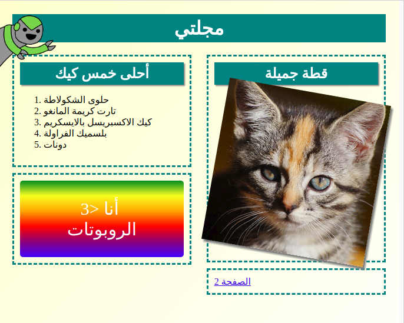

## المقدمة

في هذا المشروع، ستتعلَّم كيف تستخدم لغتَي HTML وCSS لإنشاء موقع ويب لمجلة متعددة الصفحات بتخطيط صفحتين. كما ستراجع الكثير من تقنيات HTML وCSS من المشاريع الأخرى.

  <iframe src="https://trinket.io/embed/html/a41e4e1c5c?outputOnly=true&start=result" width="600" height="500" frameborder="0" marginwidth="0" marginheight="0" allowfullscreen>
  </iframe>
  

### معلومات إضافية لقادة النادي

إذا كنت بحاجة إلى طباعة هذا المشروع، فيُرجى استخدام [نسخة سهلة الطباعة](https://projects.raspberrypi.org/en/projects/magazine/print).

--- collapse ---
---
title: ملاحظات قادة النادي
---

## المقدمة:
في هذا المشروع، سيتعلَّم الأطفال كيفية إنشاء تخطيط ذي عمودين. كما سيراجعون الكثير من تقنيات HTML وCSS التي تعلموها في المشاريع الأخرى. 

## الموارد المتوفرة على الإنترنت

نوصي باستخدام [trinket](https://trinket.io/) لكتابة ملفات HTML وCSS على الإنترنت. يحتوي هذا المشروع على ملفات trinket التالية:

+ ['مجلة' مشروع البدء -- jumpto.cc/web-magazine](http://jumpto.cc/web-magazine)

يمكن أن يستخدم الأطفال أيضًا ملف trinket الفارغ هذا [(jumpto.cc/html-blank)](http://jumpto.cc/html-blank) لكتابة ملفات HTML و CSS، أو يمكنهم استخدام قالب trinket هذا [(jumpto.cc/html-template)](http://jumpto.cc/html-template).

كما يوجد مشروع trinket يحتوي على نموذج حل للتحديات:

+ [مشروع 'مجلة' مُكتمل -- trinket.io/html/a41e4e1c5c](https://trinket.io/html/a41e4e1c5c)

## الموارد المتوفرة دون اتصال بالإنترنت
بالنسبة إلى هذا المشروع، يمكن [إكماله دون اتصال بالإنترنت](https://www.codeclubprojects.org/en-GB/resources/webdev-working-offline/) إذا كنت تفضل ذلك. يمكنك الوصول إلى موارد المشروع من خلال النقر فوق رابط "مواد المشروع" الخاص بهذا المشروع. يحتوي هذا الرابط على قسم "موارد المشروع"، الذي يتضمن الموارد التي يحتاج إليها الأطفال لإكمال هذا المشروع دون اتصال بالإنترنت. تأكد من أن كل طفل لديه حق الوصول إلى نسخة من هذه الموارد. يتضمن هذا القسم الملفات التالية:

+ intro/index.html
+ template/template.html
+ template/style.css
+ magazine/index.html
+ magazine/style.css
+ magazine/script.js
+ magazine/mutliple .png images

يمكنك أيضًا العثور على نسخة كاملة من تحديات هذا المشروع في قسم "موارد المتطوعين" الذي يحتوي على:

+ magazine-finished/index.html
+ magazine-finished/style.css
+ magazine-finished/script.js
+ magazine-finished/kitten.jpg
+ magazine-finished/recipe-finished.jpg
+ magazine-finished/greenrobot.png
+ magazine-finished/spacerobot.png

(جميع الموارد المذكورة أعلاه قابلة للتنزيل أيضًا كملفات `.zip` للمشاريع والمتطوعين).

## أهداف التعلم
+ سيتعلم الأطفال في هذا المشروع كيفية إنشاء تخطيط ذي عمودين بنمط المجلة باستخدام الخاصية `:float`. كما سيراجعون الكثير من تقنيات HTML وCSS التي تم تناولها بمزيد من التفصيل في المشاريع الأخرى. وقد تم توفير أمثلة ليتمكن الأطفال من إكمال هذا المشروع حتى وإن لم يُكملوا بعض المشاريع السابقة. 

يتناول هذا المشروع عناصر من الصفوف التالية من [المناهج الرقمية الخاصة بـ Raspberry Pi](http://rpf.io/curriculum):

+ [الأصول الأساسية للتصميمات ثنائية الأبعاد وثلاثية الأبعاد](https://www.raspberrypi.org/curriculum/design/creator).

## التحديات:
+ "أضف عناصر إلى العمود الأيسر" - وضعُ عناصر داخل عنصر تم نقله؛
+ "أضف رابطًا للعودة إلى الصفحة الأولى" - إنشاء روابط بين الصفحات في المشروع نفسه؛
+ "املأ الصفحة الثانية" - مراجعة المزيد من تقنيات HTML وCSS؛
+ "أضف رسمًا متحركًا آخر" - مراجعة الرسوم المتحركة.

--- /collapse ---

--- collapse ---
---
title: مواد المشروع
---
## موارد المشروع
* [ملف .zip يحتوي على كل موارد المشروع](resources/magazine-project-resources.zip)
* [Trinket عبر الإنترنت يحتوي على كل موارد المشروع 'مجلة'](http://jumpto.cc/web-magazine)
* [قالب Trinket عبر الإنترنت](http://jumpto.cc/trinket-template)
* [Trinket فارغ عبر الإنترنت](http://jumpto.cc/trinket-blank)
* [template/index.html](resources/template-index.html)
* [template/style.css](resources/template-style.css)
* [intro/index.html](resources/intro-index.html)
* [intro/style.css](resources/intro-style.css)
* [magazine/index.html](resources/magazine-index.html)
* [magazine/style.css](resources/magazine-style.css)
* [magazine/script.js](resources/magazine-script.js)
* [magazine/kitten.jpg](resources/magazine-kitten.jpg)
* [magazine/recipe-final.png](resources/magazine-recipe-final.png)
* [magazine/greenrobot.png](resources/magazine-greenrobot.png)
* [magazine/firerobot.png](resources/magazine-firerobot.png)
* [magazine/spacerobot.png](resources/magazine-spacerobot.png)
* [magazine/dogrobot.png](resources/magazine-dogrobot.png)

## موارد قادة النادي
* [ملف .zip يحتوي على كل موارد المشاريع المكتملة](resources/magazine-volunteer-resources.zip)
* [مشروع Trinket المكتمل على الإنترنت](https://trinket.io/html/a41e4e1c5c)
* [magazine-finished/index.html](resources/magazine-finished-index.html)
* [magazine-finished/style.css](resources/magazine-finished-style.css)
* [magazine-finished/script.js](resources/magazine-finished-script.js)
* [magazine-finished/kitten.jpg](resources/magazine-finished-kitten.jpg)
* [magazine-finished/recipe-final.png](resources/magazine-finished-recipe-final.png)
* [magazine-finished/greenrobot.png](resources/magazine-finished-greenrobot.png)
* [magazine-finished/spacerobot.png](resources/magazine-finished-spacerobot.png)

--- /collapse ---