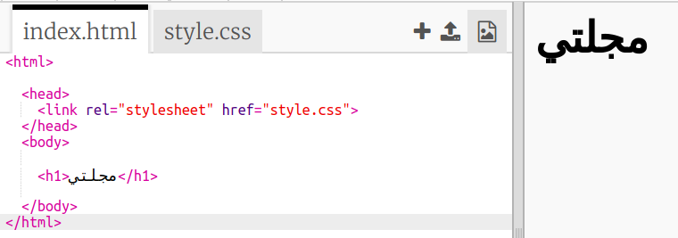
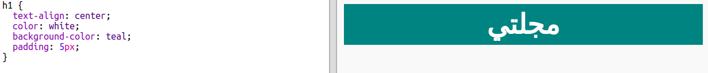
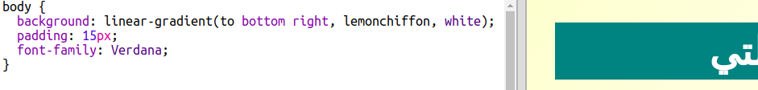

## العنوان والخلفية

غالبا ما تحتوي المواقع المصممة على شكل مجلة على الكثير من العناصر الصغيرة في صفحة.

+ افتح مشروع trinket هذا: <a href="http://jumpto.cc/web-magazine" target="_blank">jumpto.cc/web-magazine</a>.
    
    الآن يجب أن يبدو الملف الخاص بك مثل هذا:
    
    

+ لنُضف عنوناً.
    
    يمكن لك أن تفكر في title: أفضل لمجلتك.
    
    

+ هل يمكن لك أن تعطي نمطا للعنوان من إختيارك ؟
    
    إليك مثالًا، لكن يمكن لك أن تختار نمطا من عندك:
    
    

+ لنقم الآن بإنشاء خلفية مشوِّقة باستخدام التدرج واختيار خط للمجلة.
    
    إليك بعض الأمثلة للأنماط كتذكير بكيفية إنشاء التدرج:
    
    