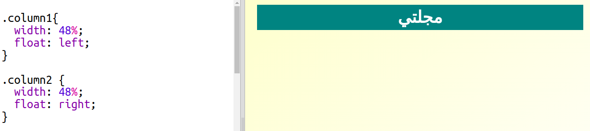

## إنشاء أعمدة

غالباً ما تستخدم مواقع الويب أعمدة متعددة في تصميمها. لننشئ تخطيط بعمودين لمجلتك.

+ أولاً، أنشئ عمودين `div`.
    
    أضف تعليمات HTML المظللة إلى ملف `index.html`:
    
    

+ واﻵن صمم العمودين divs بحيث يظهر واحد على اليسار واﻵخر على اليمين.
    
    
    
    قيمة العرض لكل عمود أقل من 50%، لذا توجد مساحة لهامش الكتابة.
    
    ستحتاج إلى إضافة شيء ما إلى العمود لرؤية النتيجة.

+ لنضف صورة قطة إلى أعلى العمود الثاني.
    
    
    
    لاحظ أن موضع صورة القطة في العمود الثاني يأخذ نصف عرض الصفحة تقريبًا.
    
    عرض الصورة هذا كبير إلى حد ما!

+ لنستخدم الخاصية `max-width:` لتتناسب الصور مع المكان الموجودة فيه.
    
    أضف النمط التالي إلى الملف `style.css`.
    
    
    
    ستنطبق هذه الخاصية على كل الصور التي تستخدمها في المجلة، لا على صورة القطة فحسب.

+ أضف الآن الفئة `photo` إلى الصورة لكي يمكنك تحديد نمط لها:
    
    

+ حدِّد نمط الصورة بإضافة ظل وإلتفاف حتى تبرُز الصورة عن الصفحة:
    
    
    
    قم بعمل تغييرات حتى تعجبك النتيجة.