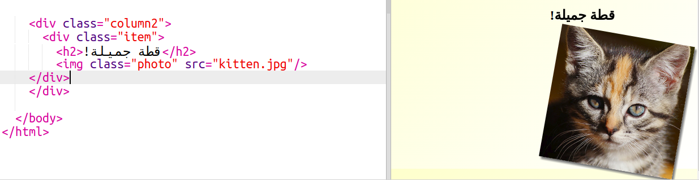
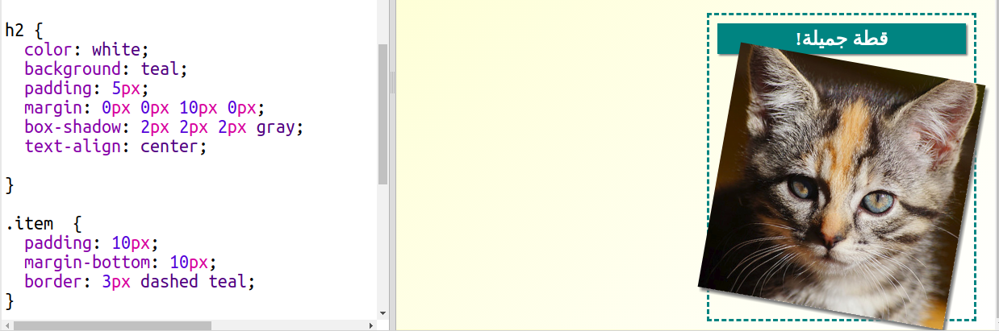

## تحديد أنماط عناصر المجلة

لنجعل التخطيط أكثر تشويقًا.

+ أضف وسم `div` حول الصورة مع `class` وأضف عنوانا بوسم `h2`:
    
    

+ حدِّد الآن نمط العنصر والعنوان.
    
    إليك مثالًا، لكن يمكنك إجراء تغييرات عليه:
    
    