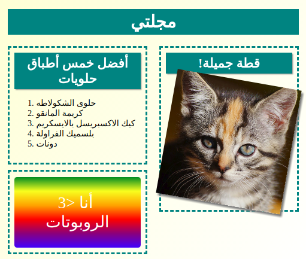
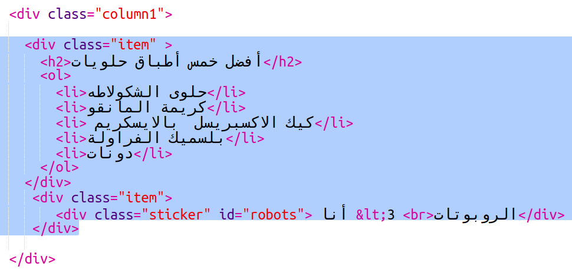

\--- challenge \---

## التحدي: أضف عناصر إلى العمود الأيسر

هل يمكنك إضافة قائمة مرتَّبة وملصق نص متدرج إلى العمود الأيسر؟

إليك مثالًا:

هذه هي التعليمات البرمجية (code) للمثال ، لكن يمكنك تغييرها أو وضع تعليمات برمجية من عندك.

HTML:

CSS:

\--- /challenge \---