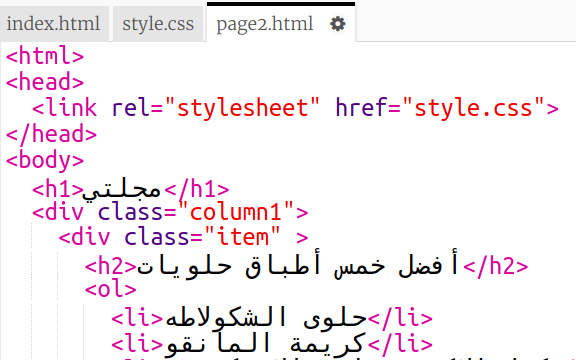
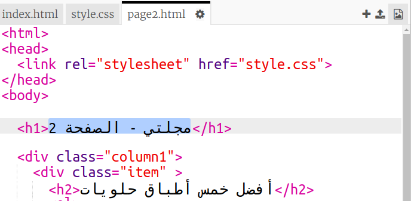

## إضافة صفحة ثانية

لنضِف صفحة ثانية إلى موقع ويب المجلة.

+ أضف صفحة جديدة إلى مشروعك وسمِّها `page2.html`:

+ ستكون الصفحة الثانية مشابهة إلى حد كبير للصفحة الأولى من المجلة، لذا يمكنك نسخ تعليمات html البرمجية من الملف `index.html` ولصقها في الملف `page2.html`.

لاحظ أن كلتا الصفحتين تستخدم الملف `style.css` نفسه، لذا ستشتركان في الأنماط.

+ غيِّر العنوان الموجود داخل الوسم `<h1>` بإضافة page2 إليه:

+ ستحتاج الآن إلى روابط بين الصفحتين حتى يمكنك الانتقال إلى الصفحة الثانية والعودة إلى الصفحة الأمامية.

انتقل إلى الملف `index.html`. وأضف رابطًا داخل وسم div ضمن العمود 2 في الملف `index.html`:

+ اختبر ذلك لترى هل يمكنك النقر فوق الرابط الجديد والانتقال إلى الصفحة الثانية من المجلة أم لا.

