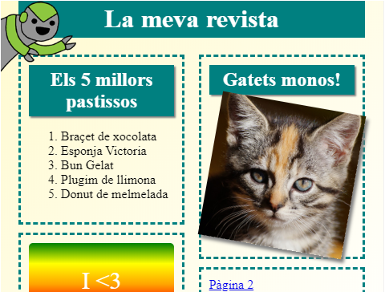

## Introducció

En aquest projecte, aprendràs a utilitzar HTML i CSS per crear un lloc web de revistes de diverses pàgines amb un disseny de dues pàgines. També revisaràs moltes tècniques HTML i CSS d'altres projectes.

  <iframe src="https://trinket.io/embed/html/a41e4e1c5c?outputOnly=true&start=result" width="600" height="505" frameborder="0" marginwidth="0" marginheight="0" allowfullscreen>
  </iframe>
  

### Informació addicional per als líders del club

Si necessites imprimir aquest projecte, si us plau utilitza la [Versió per a imprimir](https://projects.raspberrypi.org/en/projects/magazine/print).

## \--- collapse \---

## títol: Notes del líder del club

## Introducció

En aquest projecte, els nens aprendran a crear un disseny de dues columnes. També refrescaran CSS i HTML que han après en altres projectes.

## Recursos en línia

Et recomanem que facis servir [Trinket](https://trinket.io/) per escriure HTML i CSS en línia. Aquest projecte conté els següents "trinkets":

* [Punt de partida de "Revista": jumpto.cc/web-magazine](http://jumpto.cc/web-magazine)

Els nens també poden fer ús d’aquest "trinket" en blanc [(jumpto.cc/html-blank)](http://jumpto.cc/html-blank) per escriure el seu propi HTML i CSS, o alternativament poden fer servir aquesta plantilla de "trinket" [(jumpto.cc/html-template)](http://jumpto.cc/html-template).

També hi ha un "trinket" que conté una solució de mostra dels reptes:

* ["Revista" acabada: trinket.io/html/a41e4e1c5c](https://trinket.io/html/a41e4e1c5c)

## Recursos fora de línia

Aquest projecte es pot [acabar fora de línia](https://www.codeclubprojects.org/en-GB/resources/webdev-working-offline/) si així ho prefereixes. Pots accedir als recursos del projecte fent clic a l’enllaç “Materials del projecte”. Aquest enllaç conté una secció "Recursos del projecte", que inclou recursos que els nens necessitaran per completar el projecte fora de línia. Assegureu-vos que cada nen tingui accés a una còpia d'aquests recursos. Aquesta secció inclou els fitxers següents:

* intro/index.html
* template/template.html
* template/style.css
* magazine/index.html
* magazine/style.css
* magazine/script.js
* magazine/mutliple .png images

També pots trobar una versió completa dels reptes d'aquest projecte a la secció "Recursos de voluntaris", que conté:

* magazine-finished/index.html
* magazine-finished/style.css
* magazine-finished/script.js
* magazine-finished/kitten.jpg
* magazine-finished/recipe-finished.jpg
* magazine-finished/greenrobot.png
* magazine-finished/spacerobot.png

(Tots els recursos anteriors es poden descarregar com fitxers `.zip` de projectes i voluntaris.)

## Objectius d'aprenentatge

* Aquest projecte ensenya als nens com crear un disseny de revista de dues columnes aplicant l'estil `float:`. També recopila una gran part de HTML i CSS que es recull amb més detall en altres projectes. Es donen exemples perquè els nens puguin acabar aquest projecte encara que no hagin completat alguns dels anteriors. 

Aquest projecte abasta elements de les següents línies del [Raspberry Pi Digital Making Curriculum](http://rpf.io/curriculum) (Currículum de Fabricació Digital de Raspberry Pi):

* [Disseny elemental 2D i 3D](https://www.raspberrypi.org/curriculum/design/creator).

## Reptes

* "Afegeix elements a la columna de l'esquerra" - col·locant elements dins d'un element flotant;
* "Afegeix un enllaç per tornar a la primera pàgina" - creant enllaços entre pàgines d'un projecte;
* "Completa la teva segona pàgina" - afegint més HTML i CSS que has vist;
* "Afegeix una altra animació" - repassa les animacions.

\--- /collapse \---

## \--- collapse \---

## títol: Materials del projecte

## Recursos del projecte

* [Fitxer .zip que conté tots els recursos del projecte](https://rpf.io/p/en/magazine-go)
* [Trinket en línia que conté tots els recursos del projecte "Revista"](http://jumpto.cc/web-magazine)
* [Plantilla de Trinket en línia](http://jumpto.cc/trinket-template)
* [Plantilla de Trinket en línia](http://jumpto.cc/trinket-blank)
* [template/index.html](resources/template-index.html)
* [template/style.css](resources/template-style.css)
* [intro/index.html](resources/intro-index.html)
* [intro/style.css](resources/intro-style.css)
* [magazine/index.html](resources/magazine-index.html)
* [magazine/style.css](resources/magazine-style.css)
* [magazine/script.js](resources/magazine-script.js)
* [magazine/kitten.jpg](resources/magazine-kitten.jpg)
* [magazine/recipe-final.png](resources/magazine-recipe-final.png)
* [magazine/greenrobot.png](resources/magazine-greenrobot.png)
* [magazine/firerobot.png](resources/magazine-firerobot.png)
* [magazine/spacerobot.png](resources/magazine-spacerobot.png)
* [magazine/dogrobot.png](resources/magazine-dogrobot.png)

## Recursos del líder del club

* [Fitxer .zip que conté tots els recursos del projecte complet](https://rpf.io/p/en/magazine-go)
* [Projecte Trinket complet en línia](https://trinket.io/html/a41e4e1c5c)
* [magazine-finished/index.html](resources/magazine-finished-index.html)
* [magazine-finished/style.css](resources/magazine-finished-style.css)
* [magazine-finished/script.js](resources/magazine-finished-script.js)
* [magazine-finished/kitten.jpg](resources/magazine-finished-kitten.jpg)
* [magazine-finished/recipe-final.png](resources/magazine-finished-recipe-final.png)
* [magazine-finished/greenrobot.png](resources/magazine-finished-greenrobot.png)
* [magazine-finished/spacerobot.png](resources/magazine-finished-spacerobot.png)

\--- /collapse \---