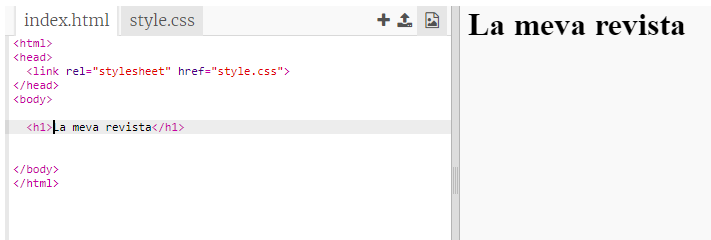
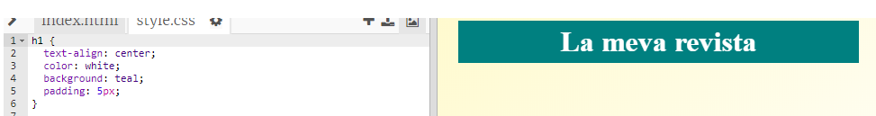
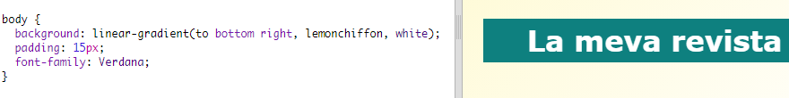

## Títol i Fons

Els llocs web de l'estil revista solen tenir molts elements petits en una pàgina. Primer crearàs un encapçalament i un fons per a la teva revista.

+ Obre aquest trinket: <a href="http://jumpto.cc/web-magazine" target="_blank">jumpto.cc/web-magazine</a>.
    
    El teu projecte hauria de ser així:
    
    

+ Afegim un encapçalament.
    
    Pots pensar en un títol millor per a la teva revista.
    
    

+ Pot afegir estil al títol?
    
    Aquí tens un exemple, però pots triar el teu propi estil:
    
    

+ Ara crearem un fons interessant amb un degradat i escollirem un tipus de lletra per a la revista.
    
    A continuació, es detallen alguns exemples d’estils per fer memòria de com crear un degradat:
    
    