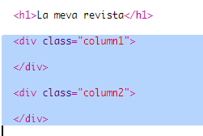
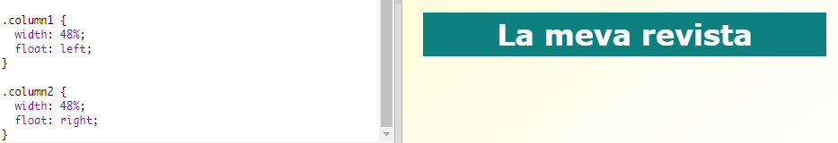
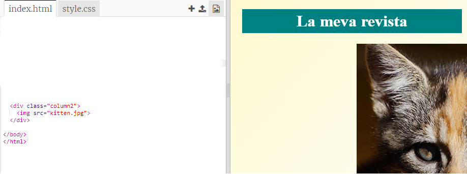
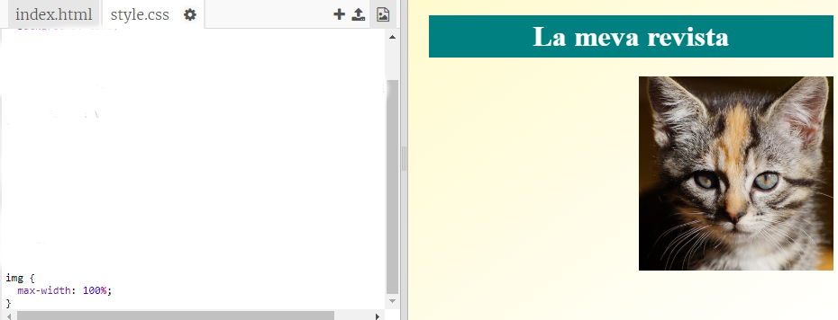

## Creant columnes

Els llocs web solen utilitzar diverses columnes. Crearem un disseny de dues columnes per a la teva revista.

+ Primer crea dos `div`s columna.
    
    Afegeix l'HTML ressaltat a `index.html`:
    
    

+ Afegeix estil als divs columna per tal que un quedi a l'esquerra i l'altra a la dreta.
    
    
    
    Cada columna és menys del 50%, per la qual cosa hi ha lloc per "padding" (espai entre contingut i la vora).
    
    Hauràs d’afegir alguna cosa a una columna per veure l’efecte.

+ Afegim una imatge de gatet a la part superior de la columna 2.
    
    
    
    Observa que la imatge del gatet està situada a la meitat de la pàgina, a la segona columna.
    
    És una mica gran però!

+ Utilitzem `max-width:` (amplada màxima) perquè les imatges s’ajustin al seu contenidor.
    
    Afegeix el següent estil a `style.css`.
    
    
    
    Això s'aplicarà a totes les imatges que utilitzis a la revista, no només al gatet.

+ Ara afegeix una classe `photo` (foto) a la imatge perquè puguis aplicar-li estil:
    
    

+ I aplica estil a la imatge per afegir una ombra i un gir per tal que la foto surti de la pàgina:
    
    
    
    Fes alguns canvis fins que t'agradi el resultat.