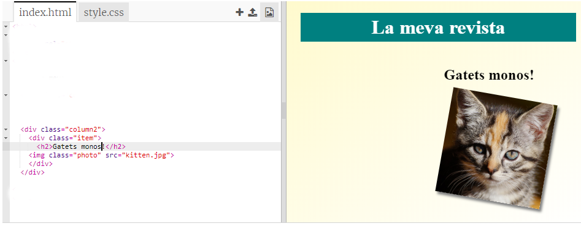
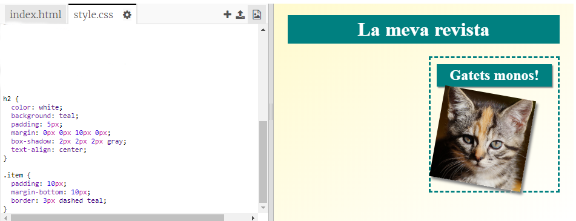

## Afegint estil als elements de la revista

Fem la composició una mica més interessant.

+ Afegeix un `div` al voltant de la imatge amb un `class` i afegeix un títol `h2`:
    
    

+ Ara aplica estil a l'element i al títol.
    
    Aquí hi ha un exemple, però pots fer canvis:
    
    