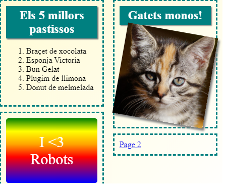
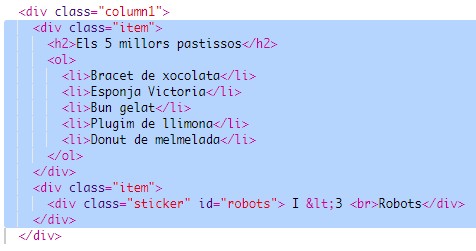

\--- challenge \---

## Repte: afegeix elements a la columna de l’esquerra

Pots afegir una llista ordenada i un degradat amb text a la columna de l’esquerra?

Aquí tens un exemple:

Aquí tens el codi de l'exemple, però pots canviar-lo o crear el teu propi.

HTML:

CSS:

\--- /challenge \---