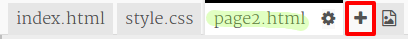
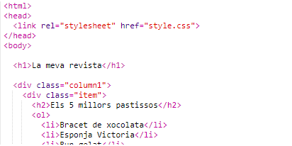
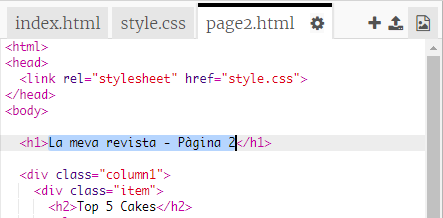
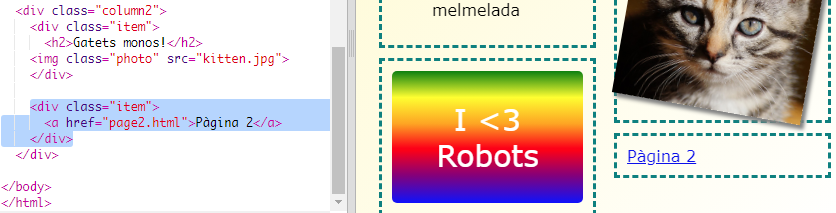

## Afegeix una segona pàgina

Ara afegirem una altra pàgina al nostre lloc web de la revista.

+ Afegeix una pàgina nova al teu projecte i posa-li el nom de `page2.html`:

+ La pàgina 2 serà força semblant a la primera pàgina de la revista, de manera que pots copiar el html des de `index.html` i enganxar-lo a `page2.html`.

Tingues en compte que les dues pàgines utilitzen el mateix `style.css` així compartiran estils.

+ Canvia el títol `<h1>` de la pàgina 2:

+ Ara necessitaràs enllaços entre les teves pàgines perquè puguis accedir a la pàgina 2 i tornar a la pàgina principal.

Torna a `index.html`. Afegeix un enllaç dins un div a la columna 2 de `index.html`:

+ Prova que pots fer clic al nou enllaç i passar a la pàgina 2 de la revista.