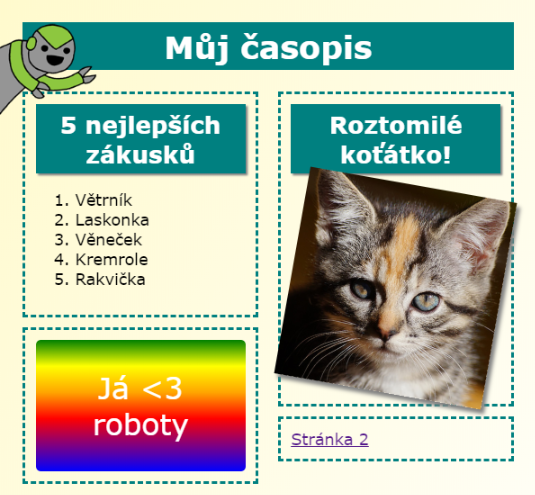

## Úvod

V tomto projektu se naučíš, jak použít HTML a CSS, a vytvořit tak vícestránkovou časopisovou webovou stránku s dvoustránkovým rozložením. Také si připomeneš hodně HTML a CSS metod z ostatních projektů.

  <iframe src="https://trinket.io/embed/html/a41e4e1c5c?outputOnly=true&start=result" width="600" height="505" frameborder="0" marginwidth="0" marginheight="0" allowfullscreen>
  </iframe>
  

### Dodatečné informace pro vedoucí kroužků

Potřebujete-li tento projekt vytisknout, použijte verzi [pro tisk](https://projects.raspberrypi.org/en/projects/magazine/print).

## \--- collapse \---

## title: Club leader notes

## Introduction

V tomto projektu se děti naučí, jak vytvořit dvousloupcové rozložení. Také si připomenou mnoho HTML a CSS triků, které se naučily v ostatních projektech.

## Online zdroje

Pro psaní HTML a CSS online doporučujeme [trinket](https://trinket.io/). Tento projekt obsahuje následující trinkety:

* [Výchozí bod pro „Časopis" -- jumpto.cc/web-magazine](http://jumpto.cc/web-magazine)

Děti mohou také použít prázdný trinket [(jumpto.cc/html-blank)](http://jumpto.cc/html-blank) a napsat si vlastní HTML a CSS kód. Popřípadě mohou použít tento předlohový trinket [(jumpto.cc/html-template)](http://jumpto.cc/html-template).

K dispozici je také trinket obsahující vzorové řešení výzev:

* [Vyřešený „Časopis" - trinket.io/html/a41e4e1c5c](https://trinket.io/html/a41e4e1c5c)

## Offline zdroje

Pokud tomu dáváte přednost, můžete tento projekt [dokončit offline](https://www.codeclubprojects.org/en-GB/resources/webdev-working-offline/). Ke zdrojům projektu se dostanete kliknutím na odkaz "materiály pro projekt". Tento odkaz obsahuje sekci "zdroje projektu", se zdroji, které děti budou potřebovat k dokončení projektu offline. Ujistěte se, že každé dítě má přístup ke kopii těchto zdrojů. Tato sekce obsahuje následující soubory:

* intro/index.html
* template/template.html
* template/style.css
* magazine/index.html
* magazine/style.css
* magazine/script.js
* magazine/vícero .png obrázků

V sekci "zdroje dobrovolníků" také můžete najít dokončenou verzi s výzvami tohoto projektu, která obsahuje:

* magazine-finished/index.html
* magazine-finished/style.css
* magazine-finished/script.js
* magazine-finished/kitten.jpg
* magazine-finished/recipe-finished.jpg
* magazine-finished/greenrobot.png
* magazine-finished/spacerobot.png

(Všechny výše zmíněné zdroje jsou také stažitelné jako `.zip` soubory.)

## Výukové cíle

* Tento projekt naučí děti, jak vytvořit dvousloupcové rozložení v časopisovém stylu za pomocí vlastnosti `float:`. Také shrnuje mnoho HTML a CSS triků, které jsou více rozvedeny v ostatních projektech. Příklady jsou zadány tak, že děti budou schopny dokončit tento projekt i přes to, že nedokončili některé dřívější projekty. 

Tento projekt zahrnuje prvky z následujících částí výukových osnov [Raspberry Pi digitální bastlení](http://rpf.io/curriculum):

* [Designování základních 2D a 3D konstrukcí](https://www.raspberrypi.org/curriculum/design/creator).

## Výzvy

* „Přidej položky do levého sloupce" - umisťování položek do elementu s vlastností float;
* „Přidej odkaz odkazující na první stránku" - vytváření odkazů mezi stránkami v projektu;
* „Zaplň druhou stránku" - shrnutí dalších HTML a CSS triků;
* „Přidej další animaci" - shrnutí animací.

\--- /collapse \---

## \--- collapse \---

## title: Materiály projektu

## Zdroje projektu

* [.zip soubor se všemi zdroji projektu](resources/magazine-project-resources.zip)
* [Online trinket se všemi zdroji projektu „Časopis"](http://jumpto.cc/web-magazine)
* [Online předlohový trinket](http://jumpto.cc/trinket-template)
* [Online prázdný trinket](http://jumpto.cc/trinket-blank)
* [template/index.html](resources/template-index.html)
* [template/style.css](resources/template-style.css)
* [intro/index.html](resources/intro-index.html)
* [intro/style.css](resources/intro-style.css)
* [magazine/index.html](resources/magazine-index.html)
* [magazine/style.css](resources/magazine-style.css)
* [magazine/script.js](resources/magazine-script.js)
* [magazine/kitten.jpg](resources/magazine-kitten.jpg)
* [magazine/recipe-final.png](resources/magazine-recipe-final.png)
* [magazine/greenrobot.png](resources/magazine-greenrobot.png)
* [magazine/firerobot.png](resources/magazine-firerobot.png)
* [magazine/spacerobot.png](resources/magazine-spacerobot.png)
* [magazine/dogrobot.png](resources/magazine-dogrobot.png)

## Zdroje pro vedoucího klubu

* [.zip soubor se všemi zdroji dokončeného projektu](resources/magazine-volunteer-resources.zip)
* [Online trinket s dokončeným projektem](https://trinket.io/html/a41e4e1c5c)
* [magazine-finished/index.html](resources/magazine-finished-index.html)
* [magazine-finished/style.css](resources/magazine-finished-style.css)
* [magazine-finished/script.js](resources/magazine-finished-script.js)
* [magazine-finished/kitten.jpg](resources/magazine-finished-kitten.jpg)
* [magazine-finished/recipe-final.png](resources/magazine-finished-recipe-final.png)
* [magazine-finished/greenrobot.png](resources/magazine-finished-greenrobot.png)
* [magazine-finished/spacerobot.png](resources/magazine-finished-spacerobot.png)

\--- /collapse \---