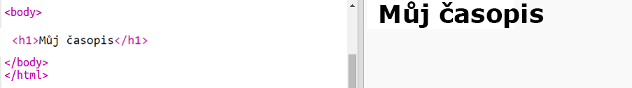
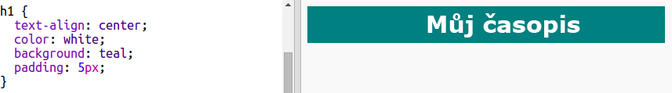
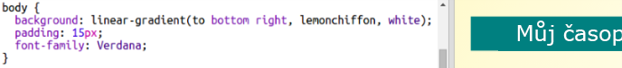

## Záhlaví a pozadí

Webové stránky časopisového stylu mají často na stránce spoustu menších položek. Do svého časopisu nejprve přidej záhlaví a pozadí.

+ Otevři tento trinket: <a href="http://jumpto.cc/web-magazine" target="_blank">jumpto.cc/web-magazine</a>.
    
    Projekt by měl vypadat takto:
    
    

+ Pojďme přidat záhlaví.
    
    Pro svůj časopis můžeš vymyslet lepší název.
    
    

+ Dokážeš stylizovat nadpis?
    
    Tady je příklad, ale můžeš použít svůj styl:
    
    

+ Nyní pojďme vytvořit zajímavé pozadí pomocí přechodu a také vybereme pro časopis písmo.
    
    Tady je vzorový styl, aby ti připomenul, jak vytvořit přechod:
    
    