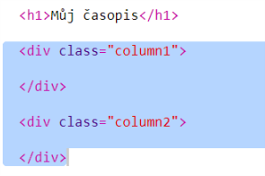
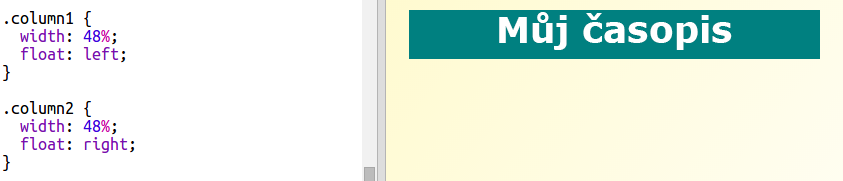
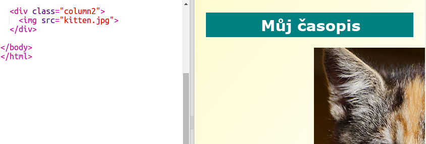
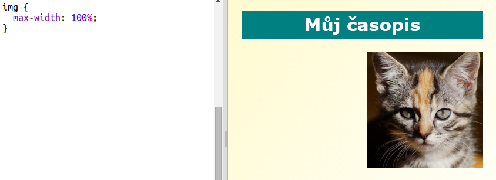

## Vytváření sloupců

Webové stránky často používají více sloupců. Pojďme vytvořit dvousloupcové rozložení pro tvůj časopis.

+ Nejprve vytvoř elementy `div` pro dva sloupce.
    
    Přidej zvýrazněný HTML kód do `index.html`:
    
    

+ Nyní nastylizuj elementy div tak, aby jeden měl vlastnost float: left a druhý float: right.
    
    
    
    Každý sloupec je menší než 50%, tudíž tu je místo pro padding.
    
    Pro zobrazení výsledku musíš něco vložit do sloupce.

+ Pojďme přidat obrázek koťátka na začátek sloupce 2.
    
    
    
    Povšimni si, že obrázek koťátka je umístěn v polovině stránky v sloupci druhém.
    
    Je ale docela velký!

+ Zkusme použít `max-width:`, aby se mohly obrázky vejít do svého kontejneru.
    
    Přidej následující styl do `style.css`.
    
    
    
    Tohle bude použito na všechny obrázky, které vložíš do časopisu, a ne jenom na koťátko.

+ Nyní přidej obrázku třídu `photo`, poté jej budeš moci nastylizovat:
    
    

+ Nyní nastylizuj obrázek - přidej stín a natoč ho, aby obrázek ze stránky vyčníval:
    
    
    
    Udělej nějaké změny, než se ti výsledek začne líbit.