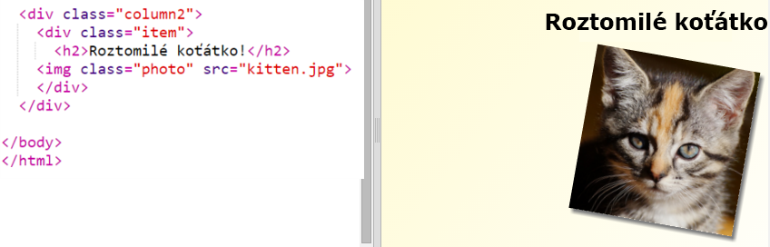
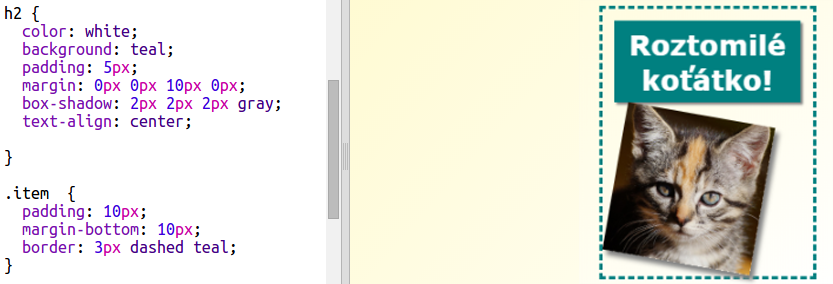

## Stylizování položek v časopisu

Pojďme udělat rozložení o něco více zajímavější.

+ Kolem svého obrázku přidej `div` s `class` atributem a přidej nadpis `h2`:
    
    

+ Nyní stylizuj obrázek a nadpis.
    
    Tady je příklad, ale můžeš to také udělat podle svého uvážení:
    
    