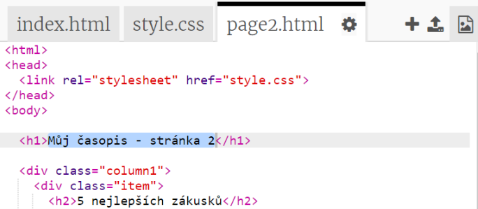

## Přidej druhou stránku

Pojďme přidat další stránku do tvé časopisové webové stránky.

+ Přidej do svého projektu novou stránku a pojmenuj ji `page2.html`:

+ Stránka 2 bude docela podobná první stránce tvého časopisu, takže můžeš zkopírovat html kód z `index.html` a vložit jej na `page2.html`.

Povšimni si, že obě stránky používají stejný CSS soubor `style.css`, takže budou mezi sebou sdílet styly.

+ Změň nadpis `<h1>` pro stránku2:

+ Nyní budeš potřebovat odkazy mezi svými stránkami tak, abychom se mohli dostat na stránku 2 a zpět na hlavní stránku.

Přejdi zpět na `index.html`. Přidej odkaz do elementu div ve sloupci 2 v `index.html`:

+ Vyzkoušej, že se po kliknutí na svůj nový odkaz přemístíš na druhou stránku svého časopisu.