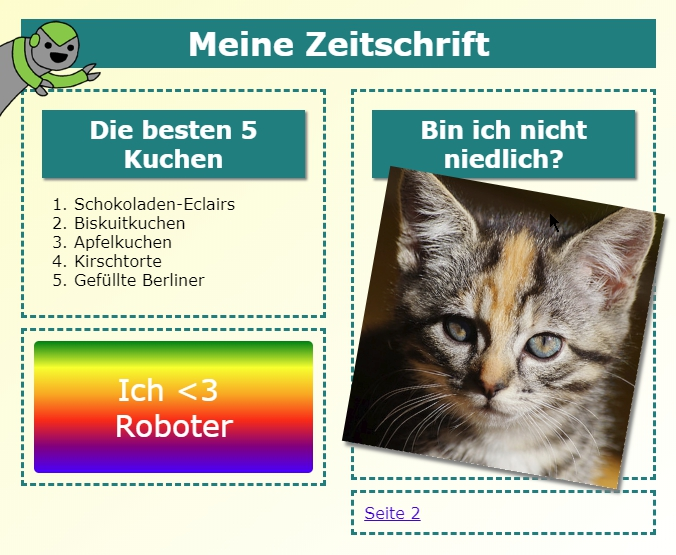

## Einleitung

In diesem Projekt lernst du, wie du HTML und CSS benutzen kannst, um eine Zeitschriften-Website mit zwei Seiten zu erstellen. Du wirst auch viele HTML- und CSS-Techniken aus früheren Projekten wiederholen.

  <iframe src="https://trinket.io/embed/html/a41e4e1c5c?outputOnly=true&start=result" width="600" height="505" frameborder="0" marginwidth="0" marginheight="0" allowfullscreen>
  </iframe>
  

### Zusätzliche Information für Clubleiter

Falls du dieses Projekt ausdrucken musst, verwende bitte die [druckfreundliche Version](https://projects.raspberrypi.org/en/projects/magazine/print).

## \--- collapse \---

## title: Anmerkungen für Clubleiter

## Einleitung:

In diesem Projekt lernen die Kinder, wie man ein Layout mit zwei Spalten programmiert. Sie werden auch viele der HTML & CSS-Konzepte verwenden, die sie in früheren Projekten gelernt haben.

## Online-Ressourcen

Wir empfehlen die Verwendung von [trinket](https://trinket.io/) um HTML & CSS online zu schreiben. Dieses Projekt enthält folgende Trinkets:

* [Start für das 'Zeitschrift'-Projekt -- jumpto.cc/web-magazine](http://jumpto.cc/web-magazine)

Die Kinder können auch dieses leere Trinket [(jumpto.cc/html-blank)](http://jumpto.cc/html-blank) verwenden um ihr eigenes HTML & CSS zu schreiben, oder sie können als Alternative dazu dieses Trinket als Vorlage verwenden [(jumpto.cc/html-template)](http://jumpto.cc/html-template).

Es gibt auch ein Trinket mit einer Beispiellösung für die Herausforderungen:

* [Fertige 'Zeitschrift' -- trinket.io/html/a41e4e1c5c](https://trinket.io/html/a41e4e1c5c)

## Offline-Ressourcen

Dieses Projekt kann wahlweise auch [offline](https://www.codeclubprojects.org/en-GB/resources/webdev-working-offline/) durchgeführt werden. Sie können auf die Projektressourcen zugreifen, indem Sie auf den Link "Projektmaterial" für dieses Projekt klicken. Dieser Link enthält einen Abschnitt "Projektressourcen" mit Ressourcen, die die Kinder benötigen, um das Projekt offline abschließen zu können. Stellen Sie sicher, dass jedes Kind Zugriff auf eine Kopie dieser Ressourcen hat. Dieser Abschnitt enthält die folgenden Dateien:

* intro/index.html
* template/template.html
* template/style.css
* magazine/index.html
* magazine/style.css
* magazine/script.js
* magazine/mutliple .png images

Eine vollständige Version dieses Projekts mit den Herausforderungen finden Sie auch im Abschnitt "Ressourcen für Freiwillige Mitarbeiter". Diese enthält:

* magazine-finished/index.html
* magazine-finished/style.css
* magazine-finished/script.js
* magazine-finished/kitten.jpg
* magazine-finished/recipe-finished.jpg
* magazine-finished/greenrobot.png
* magazine-finished/spacerobot.png

(Alle oben genannten Ressourcen werden auch zum Download als `.zip`-Dateien für das Projekt und für freiwillige Mitarbeiter bereitgestellt.)

## Lernziele

* In diesem Projekt lernen die Kinder wie man mit `float:` ein Layout mit zwei Spalten - wie in einer Zeitschrift - programmiert. Es werden auch viele HTML & CSS Befehle verwendet, die in anderen Projekten bereits ausführlich behandelt wurden. Wir verwenden viele Beispiele so dass die Kinder das Projekt beenden können, auch wenn sie nicht alle vorigen Projekte durchgeführt haben. 

Dieses Projekt umfasst Elemente aus den folgenden Teilen des [Raspberry Pi Digital Making Curriculum](http://rpf.io/curriculum):

* [Entwurf von grundlegenden 2D- and 3D-Konstruktionen](https://www.raspberrypi.org/curriculum/design/creator).

## Herausforderungen

* "Objekte in der linken Spalte hinzufügen" - Objekte in einem fliessenden Element platzieren;
* "Einen Link zurück zur ersten Seite hinzufügen" - Links zwischen den Seiten eines Projekts erstellen;
* "Eine zweite Seite mit Inhalten füllen" - mehr HTML & CSS wiederverwenden;
* "Eine neue Animation verwenden" - Animationen wiederverwenden.

\--- /collapse \---

## \--- collapse \---

## title: Projektmaterial

## Projektressourcen

* [.zip-Datei mit allen Projektressourcen](resources/magazine-project-resources.zip)
* [Online Trinket mit allen Ressourcen des 'Zeitschrift'-Projekts](http://jumpto.cc/web-magazine)
* [Online Trinket-Vorlage](http://jumpto.cc/trinket-template)
* [Leeres online-Trinket](http://jumpto.cc/trinket-blank)
* [template/index.html](resources/template-index.html)
* [template/style.css](resources/template-style.css)
* [intro/index.html](resources/intro-index.html)
* [intro/style.css](resources/intro-style.css)
* [magazine/index.html](resources/magazine-index.html)
* [magazine/style.css](resources/magazine-style.css)
* [magazine/script.js](resources/magazine-script.js)
* [magazine/kitten.jpg](resources/magazine-kitten.jpg)
* [magazine/recipe-final.png](resources/magazine-recipe-final.png)
* [magazine/greenrobot.png](resources/magazine-greenrobot.png)
* [magazine/firerobot.png](resources/magazine-firerobot.png)
* [magazine/spacerobot.png](resources/magazine-spacerobot.png)
* [magazine/dogrobot.png](resources/magazine-dogrobot.png)

## Ressourcen für Clubleiter

* [.zip-Datei mit allen fertig gestellten Projektressourcen](resources/magazine-volunteer-resources.zip)
* [Vollständiges Trinket-Projekt (online)](https://trinket.io/html/a41e4e1c5c)
* [magazine-finished/index.html](resources/magazine-finished-index.html)
* [magazine-finished/style.css](resources/magazine-finished-style.css)
* [magazine-finished/script.js](resources/magazine-finished-script.js)
* [magazine-finished/kitten.jpg](resources/magazine-finished-kitten.jpg)
* [magazine-finished/recipe-final.png](resources/magazine-finished-recipe-final.png)
* [magazine-finished/greenrobot.png](resources/magazine-finished-greenrobot.png)
* [magazine-finished/spacerobot.png](resources/magazine-finished-spacerobot.png)

\--- /collapse \---