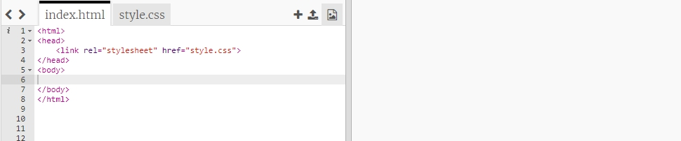
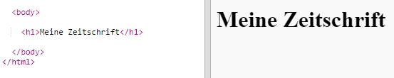
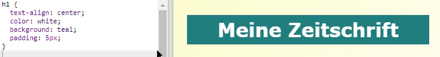
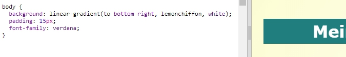

## Überschrift und Hintergrund

Webseiten im Zeitschriften-Stil haben oft viele kleine Dinge auf einer Seite. Als erstes wirst du eine Überschrift und einen Hintergrund für deine Zeitschrift erstellen.

+ Öffne diesen Trinket: <a href="http://jumpto.cc/web-magazine" target="_blank">jumpto.cc/web-magazine</a>.
    
    Das Projekt sollte so aussehen:
    
    

+ Fügen wir eine Überschrift hinzu.
    
    Du findest sicher einen besseren Titel für deine Zeitschrift.
    
    

+ Kannst du die Überschrift grafisch gestalten?
    
    Hier ist ein Beispiel, aber du kannst auch deinen eigenen Stil wählen:
    
    

+ Lass uns jetzt einen interessanten Hintergrung mit einem Farbverlauf erstellen und eine Schriftart für die Zeitschrift wählen.
    
    Hier ist Stil-Beispiel als Erinnerung, wie man einen Farbverlauf macht:
    
    