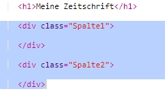
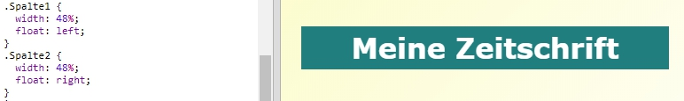
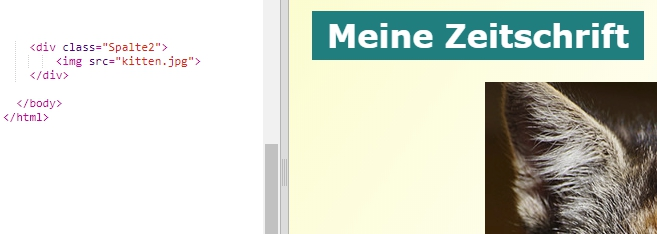
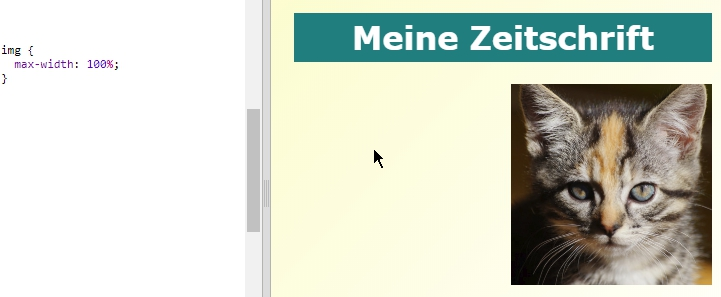
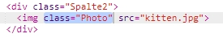
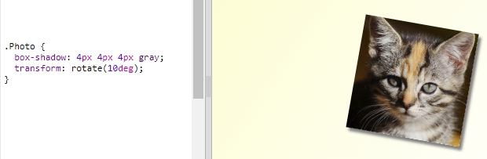

## Spalten erstellen

Webseiten benutzen oftmals mehrere Spalten. Lass uns ein Zwei-Spalten-Layout für deine Zeitschrift erstellen. 

+ Lass uns als erstes zwei Spalten `div` erstellen.

	Füge den markierten HTML Code zum `index.html` (Inhaltsverzeichnis) hinzu:

	

+ Gestalte die Spalten Divs jetzt so, dass eine nach links und die andere nach rechts „floatet“ (gleitet). 

	

	Jede Spalte beträgt weniger als 50 %, es gibt also Freiraum für die Füllung. 

	Du musst etwas in die Spalte schreiben, um die Wirkung sehen zu können. 

+ Lass uns ein Bild von einem kleinen Kätzchen oben in die 2. Spalte setzen. 

	

	Siehst du, dass das Kätzchenbild ungefähr halbwegs in der Mitte der Seite in der zweiten Spalte positioniert ist? 

	Es ist jedoch ein wenig zu groß!

+ Lass uns `max-width: ` (maximale Breite) benutzen, damit die Bilder in den jeweiligen Kasten passen. 

	Füge den folgenden Stil zu `style.css` hinzu.

	

	Dies gilt für alle Bilder, die du in deiner Zeitschrift benutzt und nicht nur für das Kätzchenbild.

+ Füge jetzt eine Klasse namens `photo` (Foto) zum Bild hinzu, damit du es grafisch gestalten kannst:

	

+ Gestalte jetzt das Bild grafisch, um einen Schatten hinzuzufügen sowie einen kleinen Twist, damit das Foto aus der Seite hervorsticht:

	

	Nimm die Veränderungen so lange vor, bis du mit dem Ergebnis zufrieden bist. 
