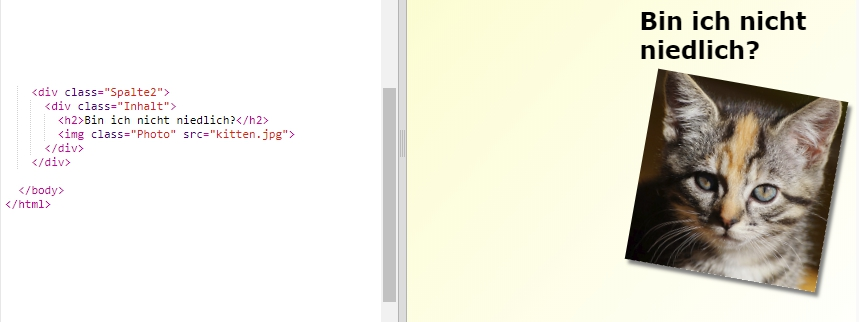
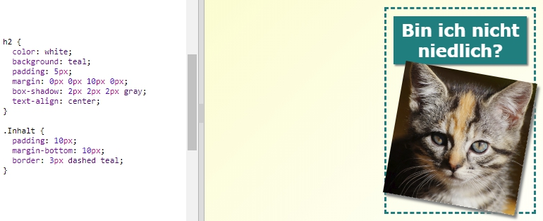

## Zeitschriftenartikel grafisch gestalten

Lass uns das Layout noch ein wenig interessanter gestalten. 

+ Füge ein `div` rund um dein Bild mit einer `class` (Klasse) und einer `h2` Überschrift hinzu:

	

+ Gestalte jetzt den Posten und die Überschrift grafisch. 

	Hier ist ein Beispiel, du kannst aber gerne Veränderungen vornehmen:

	

