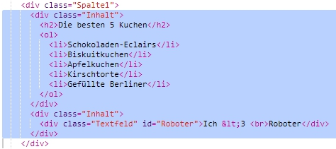
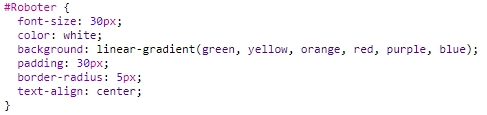

\--- challenge \---

## Herausforderung: Füge Inhalte in der linken Spalte hinzu

Kannst du eine geordnete Liste und ein Textfeld mit einem Farbverlauf in der linken Spalte hinzufügen?

Hier ist ein Beispiel:

Hier ist der Code für das Beispiel, aber du kannst ihn ändern um deine eigene Idee zu verwirklichen.

HTML:

CSS:

\--- /challenge \---