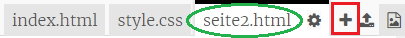
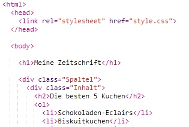
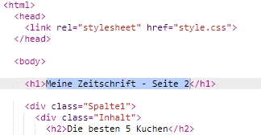
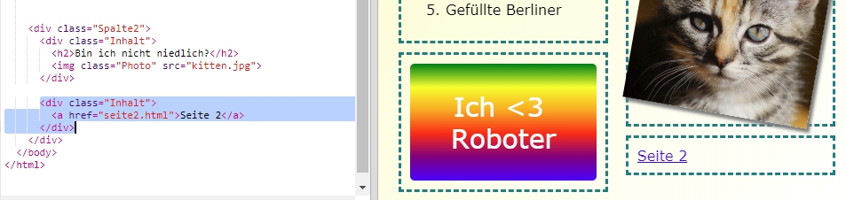

## Eine zweite Seite hinzufügen

Lass uns eine weitere Seite zu deiner Zeitschriften-Website hinzufügen.

+ Füge deinem Projekt eine neue Seite hinzu und nenne sie `seite2.html`:

+ Seite 2 wird sehr ähnlich wie die erste Seite deiner Zeitschrift, du kannst also den HTML-Code von `index.html` kopieren und ihn in `seite2.html` einfügen.

Beide Seiten verwenden das gleiche `style.css`, können also auf die gleichen Stile zurückgreifen.

+ Ändere die `<h1>`-Überschrift von seite2:

+ Now you'll need links between your pages so you can get to page 2 and back to the front page.

Gehe zurück zu `index.html`. Füge in Spalte 2 von `index.html` einen Link in einem div hinzu:

+ Teste, ob du auf den neuen Link klicken kannst und auf die Seite 2 deiner Zeitschrift gelangst.