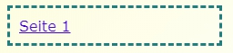

--- challenge ---

## Herausforderung: Füge einen Link hinzu, mit dem du zurück zur ersten Seite kommst

Kannst du in `seite2.html` einen Link einfügen, mit dem du beim anklicken zurück auf die Startseite kommst?

Hinweis: Sieh dir den HTML-Code an, mit dem du den Link nach Seite 2 gemacht hast.

Und ergänze den CSS-Code in <0>style.css</0>, um das Bild zu positionieren.

--- /challenge ---