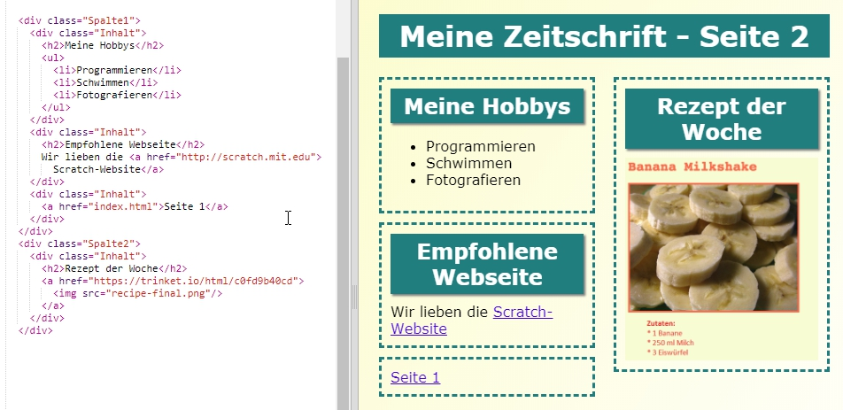
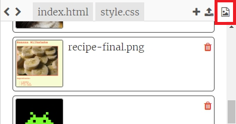
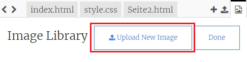

\--- challenge \---

## Herausforderung: Fülle deine zweite Seite mit Inhalt

Hier ist der Code für die Beispiele, aber du kannst die `div`'s ändern oder deine eigenen Ideen verwirklichen.

Klicke auf das Bild-Icon um die Bilder zu sehen, die du direkt benutzen kannst:

Denke auch daran, dass du deine eigenen Bilder hochladen kannst. Vergewissere dich, dass du für die Bilder, die du hochlädst, auch die Nutzungsrechte besitzst.

\--- /challenge \---