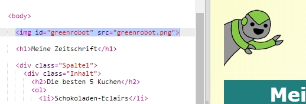
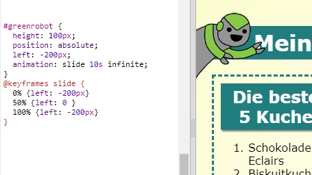

## Eine Animation hinzufügen

Lass uns eine lustige Animation in die Zeitschrift programmieren.

+ Go to `index.html` and include the `greenrobot.png` image at the top of your page.

+ Now add the CSS to animate your robot:

