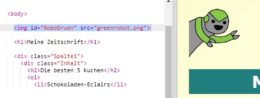
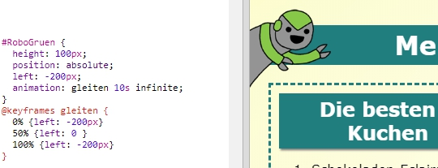

## Eine Animation hinzufügen

Lass uns eine lustige Animation in die Zeitschrift programmieren.

+ Gehe zu `index.html` und füge das Bild `greenrobot.png` oben auf der Seite ein.

+ Und ergänze dann das CSS um deinen Roboter zu bewegen:

