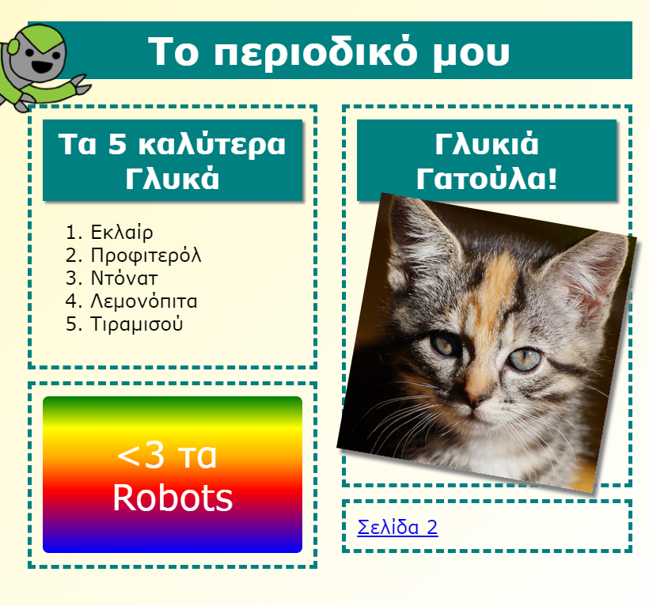

## Εισαγωγή

Σε αυτό το έργο, θα μάθεις πώς να χρησιμοποιείς την HTML και την CSS για να δημιουργήσεις έναν ιστότοπο περιοδικού με διάταξη δύο σελίδων. Θα επανεξετάσεις επίσης πολλές τεχνικές HTML και CSS από άλλα έργα.

  <iframe src="https://trinket.io/embed/html/c66f4502db?outputOnly=true&start=result" width="600" height="505" frameborder="0" marginwidth="0" marginheight="0" allowfullscreen>
  </iframe>
  

### Πρόσθετες πληροφορίες για τους συντονιστές των ομάδων

Αν χρειαστεί να εκτυπώσεις αυτό το έργο, χρησιμοποίησε την [εκτυπώσιμη έκδοση](https://projects.raspberrypi.org/el-GR/projects/magazine/print).

--- collapse ---
---
title: Σημειώσεις συντονιστή ομάδας
---

## Εισαγωγή:

Σε αυτό το πρόγραμμα, τα παιδιά θα μάθουν πώς να δημιουργήσουν μια διάταξη σε δύο στήλες. Θα θυμηθούν επίσης αρκετές από τις γνώσεις για HTML & CSS που έχουν μάθει σε άλλα έργα.

## Online Πόροι

Συνιστούμε να χρησιμοποιήσεις την εφαρμογή [trinket](https://trinket.io/) για να γράψεις HTML & CSS online. Το έργο αυτό περιλαμβάνει τα ακόλουθα trinkets:

* ['Περιοδικό' αρχικό στάδιο - jumpto.cc/web-magazine](http://jumpto.cc/web-magazine)

Τα παιδιά μπορούν επίσης να χρησιμοποιήσουν το κενό trinket [(jumpto.cc/html-blank)](http://jumpto.cc/html-blank) για να γράψουν δικό τους κώδικα HTML & CSS, ή να βασιστούν σε αυτό το πρότυπο trinket [(jumpto.cc/html-template)](http://jumpto.cc/html-template).

Υπάρχει επίσης ένα trinket που περιέχει μια υποδειγματική λύση για τις προκλήσεις:

* ['Περιοδικό' Ολοκληρωμένο - trinket.io/html/a41e4e1c5c](https://trinket.io/html/c66f4502db)

## Offline Πόροι

Αυτό το έργο μπορεί να [ολοκληρωθεί χωρίς σύνδεση](https://www.codeclubprojects.org/en-GB/resources/webdev-working-offline/) αν προτιμάς. Μπορείς να αποκτήσεις πρόσβαση στους πόρους του έργου κάνοντας κλικ στο σύνδεσμο 'Υλικό έργου'. Αυτός ο σύνδεσμος περιέχει μια ενότητα 'Πόροι έργου', η οποία περιλαμβάνει πόρους που τα παιδιά θα χρειαστούν για να ολοκληρώσουν αυτό το έργο εκτός σύνδεσης. Βεβαιώσου ότι κάθε παιδί έχει πρόσβαση σε ένα αντίγραφο αυτών των πόρων. Αυτή η ενότητα περιλαμβάνει τα ακόλουθα αρχεία:

* intro/index.html
* template/template.html
* template/style.css
* magazine/index.html
* magazine/style.css
* magazine/script.js
* magazine/mutliple .png images

Μπορείς επίσης να βρεις μια ολοκληρωμένη έκδοση των προκλήσεων αυτού του έργου στην ενότητα 'Πόροι εθελοντών', η οποία περιέχει:

* magazine-finished/index.html
* magazine-finished/style.css
* magazine-finished/script.js
* magazine-finished/kitten.jpg
* magazine-finished/recipe-finished.jpg
* magazine-finished/greenrobot.png
* magazine-finished/spacerobot.png

(Όλοι οι παραπάνω πόροι μπορούν επίσης να κατέβουν ως συμπιεσμένα `.zip` αρχεία.)

## Στόχοι μάθησης

* Αυτό το έργο διδάσκει στα παιδιά πώς να δημιουργήσουν μια διάταξη δύο στηλών σε ένα περιοδικό χρησιμοποιώντας `float:`. Υπενθυμίζει επίσης πολλά από όσα μάθαμε για τις HTML & CSS με περισσότερες λεπτομέρειες σε προηγούμενα έργα. Δίνονται παραδείγματα έτσι ώστε τα παιδιά να είναι σε θέση να ολοκληρώσουν αυτό το έργο ακόμα και αν δεν έχουν ολοκληρώσει ορισμένα από τα προηγούμενα έργα. 

Αυτό το έργο περιλαμβάνει στοιχεία από το παρακάτω μάθημα του [Raspberry Pi Digital Curriculum Making](https://rpf.io/curriculum):

* [Σχεδιασμός βασικών στοιχείων 2D και 3D](https://www.raspberrypi.org/curriculum/design/creator).

## Προκλήσεις

* "Προσθήκη στοιχείων στην αριστερή στήλη" - τοποθέτηση αντικειμένων μέσα σε ένα στοιχείο "float".
* "Προσθήκη ενός συνδέσμου επαναφοράς στην πρώτη σελίδα" - δημιουργία συνδέσμων μεταξύ σελίδων σε ένα έργο.
* "Συμπλήρωσε τη δεύτερη σελίδα σου" - επαναλαμβάνοντας όσα είδαμε από τις HTML & CSS.
* "Προσθήκη άλλης μίας κινούμενης εικόνας" - εμπέδωση των κινούμενων εικόνων.

--- /collapse ---

--- collapse ---
---
title: Υλικό έργου
---

## Πόροι του έργου

* [αρχείο .zip που περιέχει όλους τους πόρους του έργου](resources/magazine-project-resources.zip)
* [Online Trinket που περιέχει όλους τους πόρους του έργου 'Περιοδικό'](http://jumpto.cc/web-magazine)
* [Online πρότυπο Trinket](http://jumpto.cc/trinket-template)
* [Online κενό Trinket](http://jumpto.cc/trinket-blank)
* [template/index.html](resources/template-index.html)
* [template/style.css](resources/template-style.css)
* [intro/index.html](resources/intro-index.html)
* [intro/style.css](resources/intro-style.css)
* [magazine/index.html](resources/magazine-index.html)
* [magazine/style.css](resources/magazine-style.css)
* [magazine/script.js](resources/magazine-script.js)
* [magazine/kitten.jpg](resources/magazine-kitten.jpg)
* [magazine/recipe-final.png](resources/magazine-recipe-final.png)
* [magazine/greenrobot.png](resources/magazine-greenrobot.png)
* [magazine/firerobot.png](resources/magazine-firerobot.png)
* [magazine/spacerobot.png](resources/magazine-spacerobot.png)
* [magazine/dogrobot.png](resources/magazine-dogrobot.png)

## Πόροι συντονιστή ομάδας

* [αρχείο .zip που περιέχει όλους τους πόρους του έργου](resources/magazine-volunteer-resources.zip)
* [Online ολοκληρωμένο έργο στο Τrinket](https://trinket.io/html/c66f4502db)
* [magazine-finished/index.html](resources/magazine-finished-index.html)
* [magazine-finished/style.css](resources/magazine-finished-style.css)
* [magazine-finished/script.js](resources/magazine-finished-script.js)
* [magazine-finished/kitten.jpg](resources/magazine-finished-kitten.jpg)
* [magazine-finished/recipe-final.png](resources/magazine-finished-recipe-final.png)
* [magazine-finished/greenrobot.png](resources/magazine-finished-greenrobot.png)
* [magazine-finished/spacerobot.png](resources/magazine-finished-spacerobot.png)

--- /collapse ---