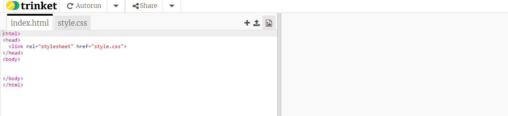
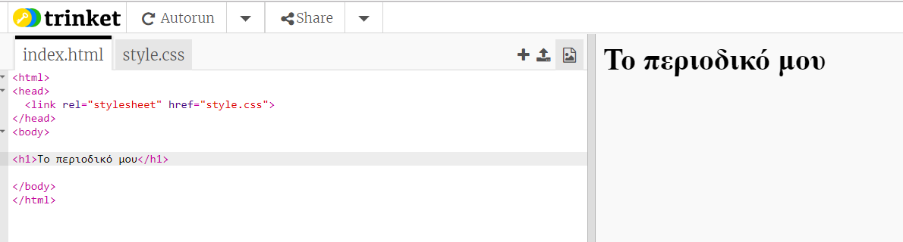
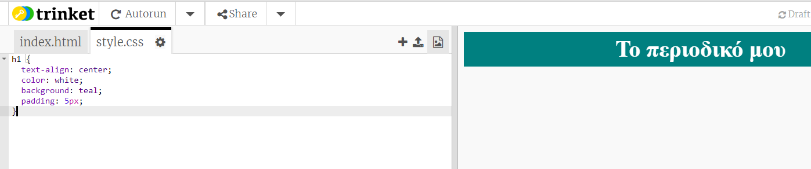

## Επικεφαλίδα και υπόβαθρο

Οι ιστοσελίδες σε στυλ σε περιοδικά έχουν συχνά πολλά μικρά αντικείμενα σε μια σελίδα. Αρχικά θα δημιουργήσετε μια επικεφαλίδα και φόντο για το περιοδικό σας.

+ Ανοίξτε αυτό το μπιχλιμπίδι: <a href="http://jumpto.cc/web-magazine" target="_blank">jumpto.cc/web-magazine</a>.
    
    Το έργο πρέπει να έχει ως εξής:
    
    

+ Ας προσθέσουμε μια επικεφαλίδα.
    
    Μπορείτε να σκεφτείτε έναν καλύτερο τίτλο για το περιοδικό σας.
    
    

+ Μπορείτε να ακολουθήσετε την κατεύθυνση;
    
    Ακολουθεί ένα παράδειγμα, αλλά μπορείτε να επιλέξετε το δικό σας στυλ:
    
    

+ Τώρα ας δημιουργήσουμε ένα ενδιαφέρον φόντο χρησιμοποιώντας μια κλίση και επιλέγουμε μια γραμματοσειρά για το περιοδικό.
    
    Ακολουθεί ένα παράδειγμα στυλ ως υπενθύμιση του τρόπου δημιουργίας κλίσης:
    
    