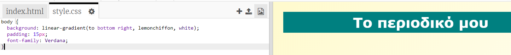

## Επικεφαλίδα και υπόβαθρο

Οι ιστοσελίδες τύπου "περιοδικό" έχουν συχνά πολλά μικρά αντικείμενα σε μια σελίδα. Αρχικά θα δημιουργήσετε μια επικεφαλίδα και φόντο για το περιοδικό σας.

+ Άνοιξε αυτό το trinket: <a href="http://jumpto.cc/web-magazine" target="_blank">jumpto.cc/web-magazine</a>.
    
    Το έργο πρέπει να μοιάζει έτσι:
    
    

+ Ας προσθέσουμε μια επικεφαλίδα.
    
    Μπορείς να σκεφτείς έναν καλύτερο τίτλο για το περιοδικό σου.
    
    

+ Μπορείτε να μορφοποιήσεις την επικεφαλίδα;
    
    Ακολουθεί ένα παράδειγμα, αλλά μπορείς να επιλέξεις το δικό σου στυλ:
    
    

+ Τώρα ας δημιουργήσουμε ένα ενδιαφέρον φόντο δημιουργώντας βαθμιαία αλλαγή χρώματος και επιλέγοντας μια γραμματοσειρά για το περιοδικό.
    
    Ακολουθεί ένα παράδειγμα στυλ για να θυμηθούμε τον τρόπο με τον οποίο μπορεί να αλλάζει βαθμιαία το χρώμα:
    
    