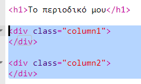
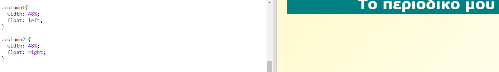
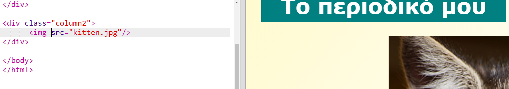
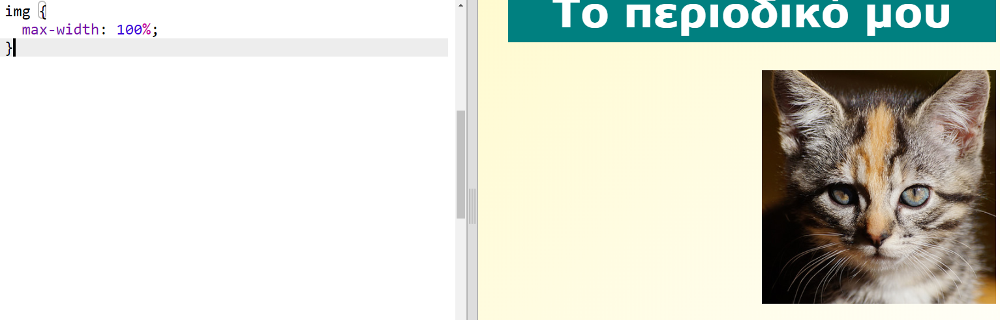

## Δημιουργία Στηλών

Οι ιστοσελίδες χρησιμοποιούν συχνά πολλές στήλες. Ας δημιουργήσουμε μια διάταξη δύο στηλών για το περιοδικό σου.

+ Αρχικά δημιούργησε δύο στήλες `div`s.
    
    Πρόσθεσε τον τονισμένο HTML κώδικα στο `index.html`:
    
    

+ Τώρα παραμετροποίησε τις ετικέτες (divs) για τις στήλες έτσι ώστε η μία να "κάνει float" ("επιπλέει") προς τα αριστερά και τη άλλη προς τα δεξιά.
    
    
    
    Κάθε στήλη είναι μικρότερη από 50%, ώστε να υπάρχει χώρος για να μπουν επιπλέον αντικείμενα (padding).
    
    Θα χρειαστεί να προσθέσεις κάτι στη στήλη για να δεις το αποτέλεσμα.

+ Ας προσθέσουμε μια εικόνα γατάκι στην κορυφή της στήλης 2.
    
    
    
    Παρατηρήστε ότι η εικόνα γατάκι είναι τοποθετημένη περίπου στη μέση της σελίδας, στη δεύτερη στήλη.
    
    Είναι όμως λίγο μεγάλο!

+ Ας χρησιμοποιήσουμε το `max-width:` για να κάνουμε τις εικόνες να ταιριάζουν μέσα στο δοχείο τους.
    
    Προσθέστε το ακόλουθο στυλ στο `style.css`.
    
    
    
    Αυτό ισχύει για όλες τις εικόνες που χρησιμοποιείτε στο περιοδικό σας, όχι μόνο για το γατάκι.

+ Τώρα προσθέστε μια τάξη `φωτογραφία` την εικόνα ώστε να μπορείτε να το στυλ:
    
    

+ Και στυλ της εικόνας για να προσθέσετε μια σκιά και μια συστροφή για να φτιάξετε τη φωτογραφία έξω από τη σελίδα:
    
    
    
    Κάντε κάποιες αλλαγές έως ότου σας αρέσει το αποτέλεσμα.