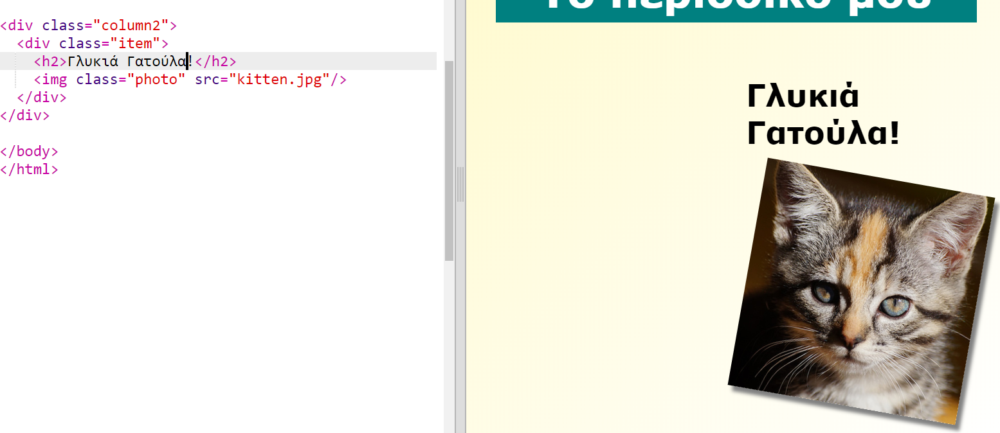

## Στοιχεία περιοδικού στυλ

Ας κάνουμε τη διάταξη πιο ενδιαφέρουσα.

+ Προσθέστε ένα `div` γύρω από την εικόνα σας με `class` και προσθέστε μια επικεφαλίδα `h2`:
    
    

+ Τώρα στυλ το στοιχείο και την επικεφαλίδα.
    
    Ακολουθεί ένα παράδειγμα, αλλά μπορείτε να κάνετε αλλαγές:
    
    