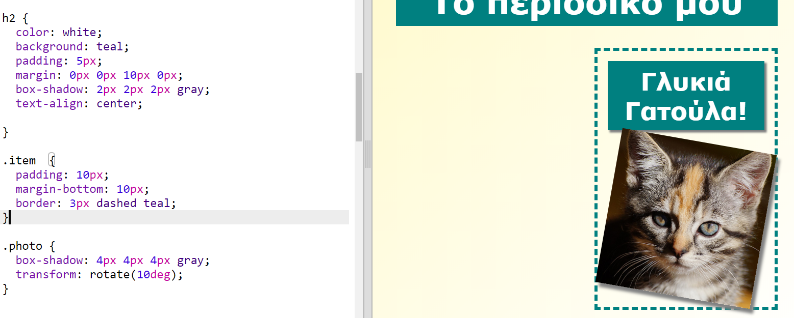

## Μορφοποίηση στοιχείων του περιοδικού

Ας κάνουμε τη διάταξη ακόμη πιο ενδιαφέρουσα.

+ Πρόσθεσε μία `ετικέτα (div)` γύρω από την εικόνα σου με `κλάση` και πρόσθεσε μια επικεφαλίδα `h2`:
    
    

+ Τώρα μορφοποίησε το στοιχείο και την επικεφαλίδα.
    
    Ακολουθεί ένα παράδειγμα, αλλά μπορείς να το κάνεις διαφορετικά:
    
    