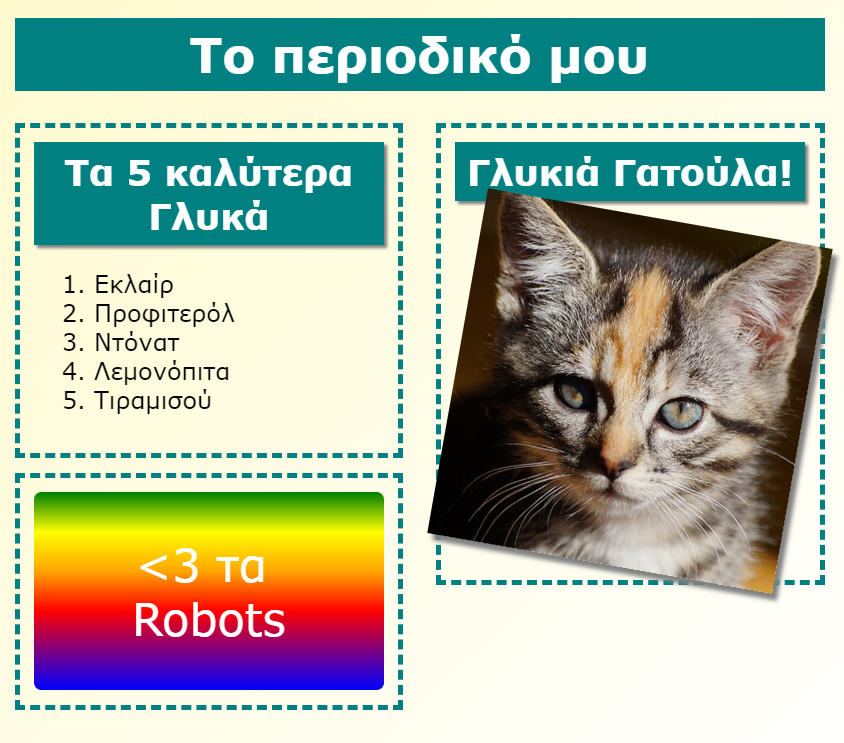

\--- πρόκληση \---

## Πρόκληση: Προσθέστε στοιχεία στην αριστερή στήλη

Μπορείτε να προσθέσετε μια ταξινομημένη λίστα και ένα αυτοκόλλητο κειμένου κλίσης στην αριστερή στήλη;

Ακολουθεί ένα παράδειγμα:

Αυτός είναι ο κώδικας για το παράδειγμα, αλλά μπορείτε να το αλλάξετε ή να δημιουργήσετε το δικό σας.

HTML:

CSS:

\--- / πρόκληση \---