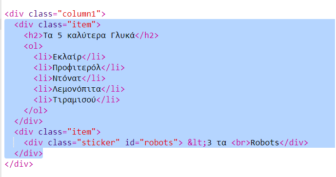

--- challenge ---

## Πρόκληση: Πρόσθεσε στοιχεία στην αριστερή στήλη

Μπορείς να προσθέσεις μια λίστα με αρίθμηση και ένα αυτοκόλλητο με κείμενο και βαθμιαία αλλαγή χρώματος στην αριστερή στήλη;

Ακολουθεί ένα παράδειγμα:

Αυτός είναι ο κώδικας για το παράδειγμα, αλλά μπορείς να το αλλάξεις ή να δημιουργήσεις το δικό σου.

HTML:

CSS:

--- /challenge ---