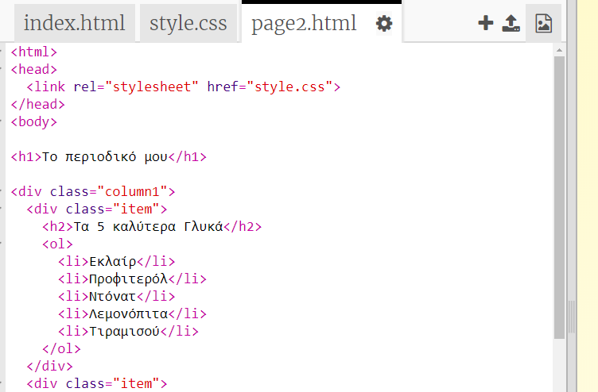
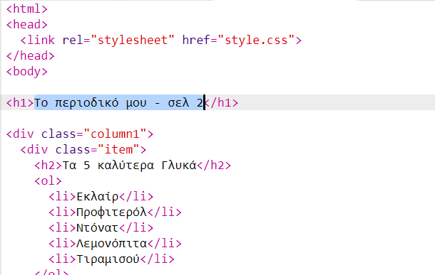
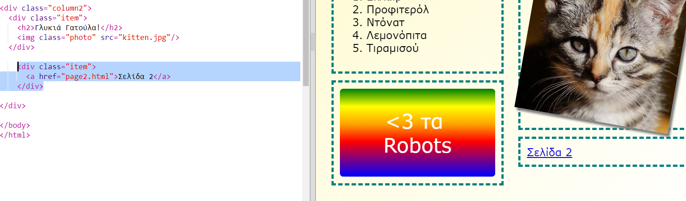

## Πρόσθεσε μια δεύτερη σελίδα

Ας προσθέσουμε άλλη μία σελίδα στην ιστοσελίδα του περιοδικού σου.

+ Πρόσθεσε μια νέα σελίδα στο έργο σου και ονόμασέ τη `page2.html`:

+ Η σελίδα 2 θα είναι αρκετά παρόμοια με την πρώτη σελίδα του περιοδικού σου, ώστε να μπορείς να αντιγράψεις τον κώδικα html από την `index.html` και να τον επικολλήσεις στην `page2.html`.

Παρατήρησε ότι και οι δύο σελίδες χρησιμοποιούν το ίδιο αρχείο κώδικα CSS `style.css` ώστε να έχουν την ίδια μορφοποίηση.

+ Άλλαξε τον τίτλο `<h1>` για τη σελίδα2:

+ Τώρα θα χρειαστείς συνδέσμους μεταξύ των σελίδων ώστε να μπορείς να πας στη σελίδα 2, αλλά και να επιστρέψεις στην αρχική.

Επίστρεψε στο `index.html`. Πρόσθεσε ένα σύνδεσμο μέσα σε μία ετικέτα στη στήλη 2 στο `index.html`:

+ Έλεγξε το ότι μπορείς να κάνεις κλικ στον νέο σου σύνδεσμο και να μεταβείς στη σελίδα 2 του περιοδικού σου.