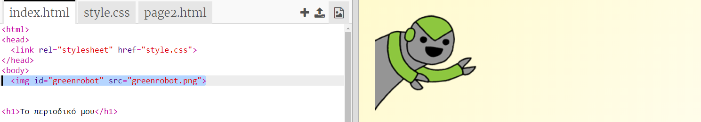
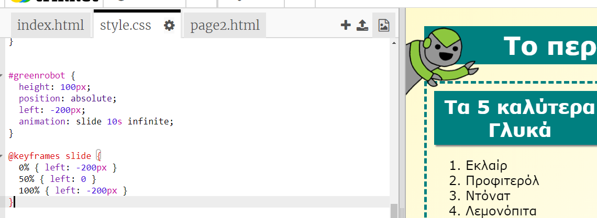

## Πρόσθεσε μια κινούμενη εικόνα

Ας προσθέσουμε μια διασκεδαστική κινούμενη εικόνα στο περιοδικό σου.

+ Πήγαινε στο `index.html` και τοποθέτησε την εικόνα `greenrobot.png` στο πάνω μέρος της σελίδας σου.

+ Τώρα πρόσθεσε το CSS κώδικα για να ζωντανέψεις το ρομπότ σου:

