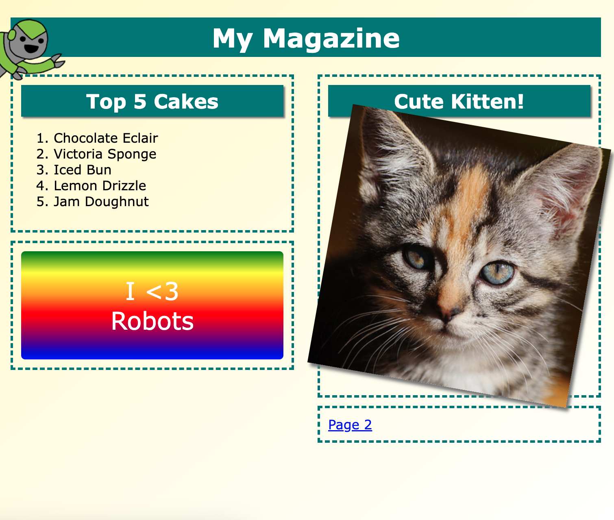

## What you will make

Learn how to use HTML and CSS to create a multi-page magazine website. 

--- print-only ---

--- /print-only ---

--- no-print ---

<iframe src="https://editor.raspberrypi.org/en/embed/viewer/magazine-complete" width="100%" height="900" frameborder="0" marginwidth="0" marginheight="0" allowfullscreen> </iframe>

--- /no-print ---

