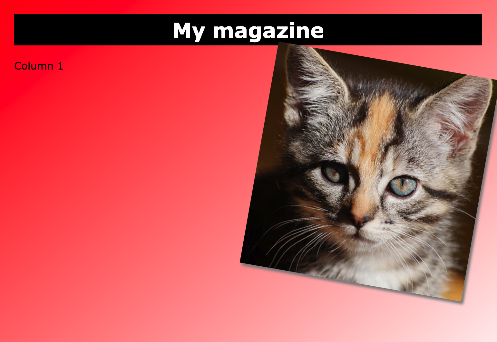

## Columns

Websites often use multiple columns. Create a two column layout for your magazine.

--- task ---

Select the `index.html` file and add code to create two columns 

--- code ---
---
language: html
filename: index.html
line_numbers: true
line_number_start: 7
line_highlights: 9-14
---
<body>
<h1>My magazine</h1>

	Column 1

	Column 2

</body>

--- /code ---

--- /task ---

--- task ---

Switch back to `style.css` and find the styles for `column1` and `column2`.

--- /task ---

--- task ---

Add a `float` property to each column style so that one floats to the left and the other floats to the right.

--- code ---
---
language: css
filename: style.css
line_numbers: true
line_number_start: 14
line_highlights: 16, 21
---
.column1 {
    width: 48%;
	float: left;
}

.column2 {
    width: 48%;
	float: right;
}

--- /code ---

--- /task ---

--- task ---

Replace the `Column 2` text with a kitten picture.

--- code ---
---
language: html
filename: index.html
line_numbers: true
line_number_start: 12
line_highlights: 13
---

	

</body>

--- /code ---

--- /task ---

--- task ---

Add a class `photo` to the image so that you can style it:

--- code ---
---
language: html
filename: index.html
line_numbers: true
line_number_start: 12
line_highlights: 13
---

	

</body>

--- /code ---

--- /task ---

--- task ---

Switch to `style.css` and experiment with changing the numbers to alter the size of the shadow and the angle of the image.

--- code ---
---
language: css
filename: style.css
line_numbers: true
line_number_start: 28
line_highlights: 29-30
---
.photo {
    box-shadow: 4px 4px 4px gray;
    transform: rotate(10deg);
}
--- /code ---

--- /task ---

