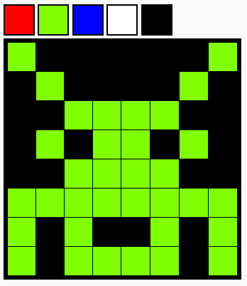

## What can you do now?

If you are following the [HTML & CSS: Module 2](https://projects.raspberrypi.org/en/pathways/webdev-module-2){:target="_blank"} pathway, you can move on to the [Pixel art](https://projects.raspberrypi.org/en/projects/pixel-art/){:target="_blank"} project. In this project, you will create a pixel art editor.

--- print-only --- 

--- /print-only ---

--- no-print ---

<iframe src="https://editor.raspberrypi.org/en/embed/viewer/editor-pixel-art-finished" width="100%" height="500" frameborder="0" marginwidth="0" marginheight="0" allowfullscreen> </iframe>

--- /no-print ---

Or, why not try out another [HTML & CSS](https://projects.raspberrypi.org/en/projects?software%5B%5D=html-css-javascript){:target="_blank"} project?