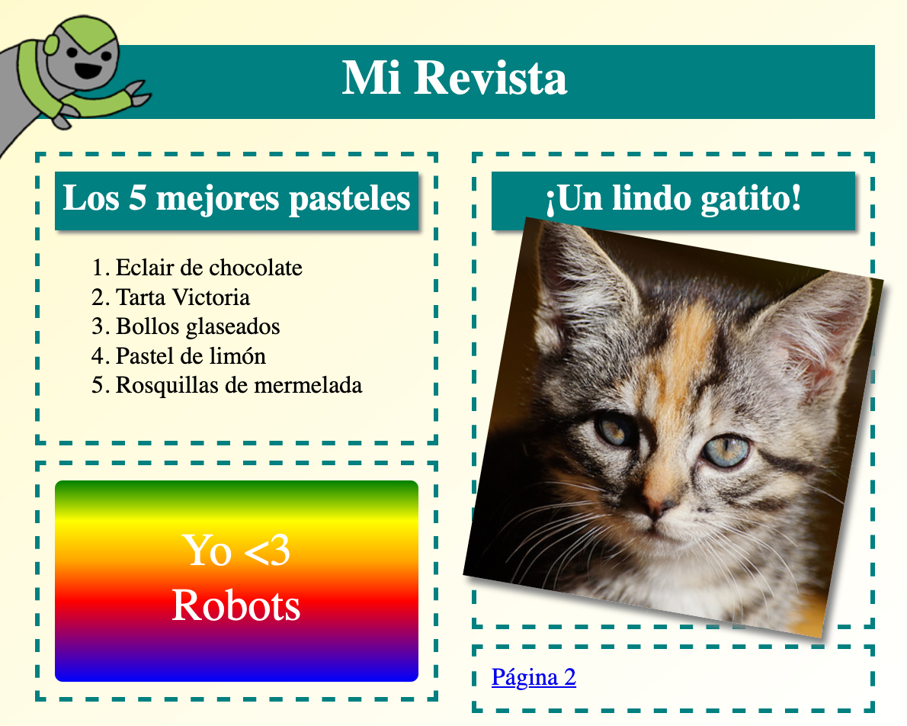

## Introducción

In this project, you'll learn how to use HTML and CSS to create a multi-page magazine website with a two page layout. You'll also revisit lots of HTML and CSS techiques from other projects.

  <iframe src="https://trinket.io/embed/html/a41e4e1c5c?outputOnly=true&start=result" width="600" height="505" frameborder="0" marginwidth="0" marginheight="0" allowfullscreen>
  </iframe>
  

### Información adicional para líderes de club

Si necesitas imprimir este proyecto, usa la [versión para imprimir](https://projects.raspberrypi.org/en/projects/magazine/print).

## \--- collapse \---

## título: Notas del líder del club

## Introducción:

In this project, children will learn how to create a two-column layout. They will also recap lots of the HTML & CSS that they have learned in other projects.

## Recursos en línea

Recomendamos el uso de [ trinket](https://trinket.io/) para escribir HTML & CSS en línea. Este proyecto contiene los siguientes trinkets:

* ['Magazine' starting point -- jumpto.cc/web-magazine](http://jumpto.cc/web-magazine)

Los niños también pueden hacer uso de esta baratija en blanco [ (jumpto.cc/html-blank) ](http://jumpto.cc/html-blank) para escribir su propio HTML & CSS, o alternativamente pueden usar este trinket plantilla [ (jumpto.cc/html-template) ](http://jumpto.cc/html-template).

También hay una baratija que contiene una solución de muestra para los desafíos:

* ['Magazine' Finished -- trinket.io/html/a41e4e1c5c](https://trinket.io/html/a41e4e1c5c)

## Recursos sin conexión

Este proyecto se puede [completar sin conexión](https://www.codeclubprojects.org/en-GB/resources/webdev-working-offline/) si se prefiere. Se puede acceder a los recursos del proyecto haciendo clic en el enlace 'Materiales del proyecto'. Este enlace contiene una sección de 'Recursos del proyecto', que incluye los recursos que los niños necesitarán para completar este proyecto sin conexión. Asegúrate de que cada niño tenga acceso a una copia de estos recursos. Esta sección incluye los siguientes archivos:

* intro/index.html
* template/template.html
* template/style.css
* magazine/index.html
* magazine/style.css
* magazine/script.js
* magazine/mutliple .png images

También puedes encontrar una versión completa de los desafíos de este proyecto en la sección 'Recursos para voluntarios', que contiene:

* magazine-finished/index.html
* magazine-finished/style.css
* magazine-finished/script.js
* magazine-finished/kitten.jpg
* magazine-finished/recipe-finished.jpg
* magazine-finished/greenrobot.png
* magazine-finished/spacerobot.png

(Todos los recursos anteriores también se pueden descargar como archivos `.zip` de proyectos y voluntarios.)

## Objetivos del Aprendizaje

* This project teaches children how to create a two-column magazine style layout using `float:`. It also recaps lots of the HTML & CSS that is covered in more detail in other projects. Examples are given so children will be able to complete this project even if they have not completed some of the earlier projects. 

Este proyecto incluye elementos de los siguientes aspectos del [Currículo de creación digital de Raspberry Pi](http://rpf.io/curriculum):

* [Design basic 2D and 3D assets](https://www.raspberrypi.org/curriculum/design/creator).

## Retos

* "Add items to the left column" - placing items inside a floated element;
* "Add a link back to the first page" - creating links between pages in a project;
* "Fill in your second page" - recapping more HTML & CSS;
* "Add another animation" - recapping animations.

\--- /collapse \---

## \--- collapse \---

## title: Materiales del proyecto

## Recursos del proyecto

* [Archivo .zip que contiene todos los recursos del proyecto](resources/magazine-project-resources.zip)
* [Online Trinket containing all 'Magazine' project resources](http://jumpto.cc/web-magazine)
* [Online Trinket template](http://jumpto.cc/trinket-template)
* [Online blank Trinket](http://jumpto.cc/trinket-blank)
* [template/index.html](resources/template-index.html)
* [template/style.css](resources/template-style.css)
* [intro/index.html](resources/intro-index.html)
* [intro/style.css](resources/intro-style.css)
* [magazine/index.html](resources/magazine-index.html)
* [magazine/style.css](resources/magazine-style.css)
* [magazine/script.js](resources/magazine-script.js)
* [magazine/kitten.jpg](resources/magazine-kitten.jpg)
* [magazine/recipe-final.png](resources/magazine-recipe-final.png)
* [magazine/greenrobot.png](resources/magazine-greenrobot.png)
* [magazine/firerobot.png](resources/magazine-firerobot.png)
* [magazine/spacerobot.png](resources/magazine-spacerobot.png)
* [magazine/dogrobot.png](resources/magazine-dogrobot.png)

## Recursos para los líderes de clubes

* [Archivo .zip que contiene todos los recursos de proyecto terminado](resources/magazine-volunteer-resources.zip)
* [Proyecto Trinket terminado en línea](https://trinket.io/html/a41e4e1c5c)
* [magazine-finished/index.html](resources/magazine-finished-index.html)
* [magazine-finished/style.css](resources/magazine-finished-style.css)
* [magazine-finished/script.js](resources/magazine-finished-script.js)
* [magazine-finished/kitten.jpg](resources/magazine-finished-kitten.jpg)
* [magazine-finished/recipe-final.png](resources/magazine-finished-recipe-final.png)
* [magazine-finished/greenrobot.png](resources/magazine-finished-greenrobot.png)
* [magazine-finished/spacerobot.png](resources/magazine-finished-spacerobot.png)

\--- /collapse \---