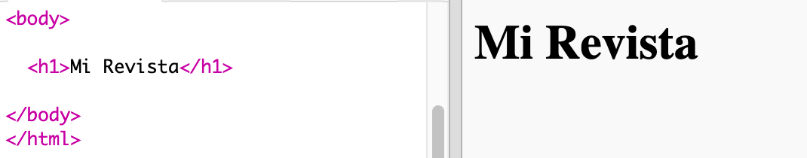

## Encabezado y fondo

Las páginas web diseñadas al estilo de una revista a menudo tienen muchos objetos pequeños en sus páginas. En primer lugar, vamos a crear un encabezado con un fondo para tu revista.

+ Abre este trinket: <a href="http://jumpto.cc/web-magazine" target="_blank">jumpto.cc/web-magazine</a>. Si estás leyendo este proyecto en línea, también puedes usar la versión incrustada de este trinket que encontrarás más abajo.

  <iframe src="https://trinket.io/embed/html/cef5e64bc0" width="100%" height="400" frameborder="0" marginwidth="0" marginheight="0" allowfullscreen>
  </iframe>

+ Vamos a añadir un encabezado.

	Puedes cambiar el título de tu revista por otro mejor que se te ocurra.

	

+ ¿Puedes dar estilo al encabezado?

	Este es un ejemplo, pero puedes escoger tu propio estilo:

	

+ Ahora crearemos un fondo interesante usando el degradado, y escogeremos una fuente para la revista.

	Aquí tienes un ejemplo de estilo para recordarte cómo se crea un degradado:

	

