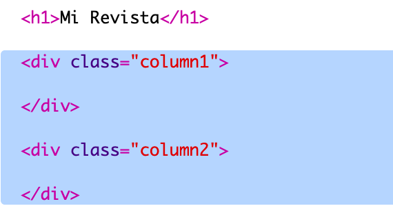
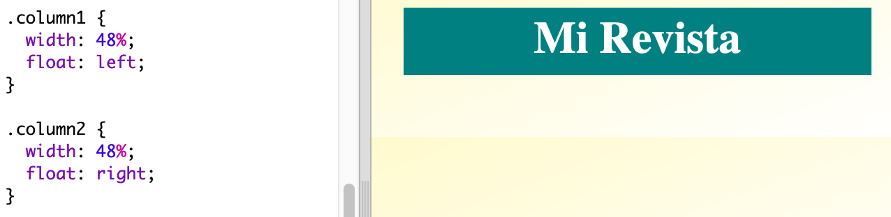
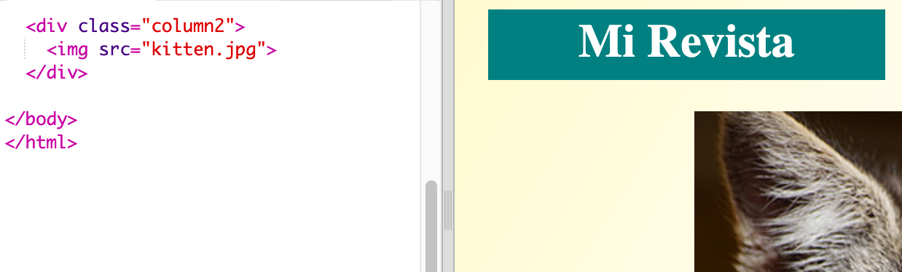
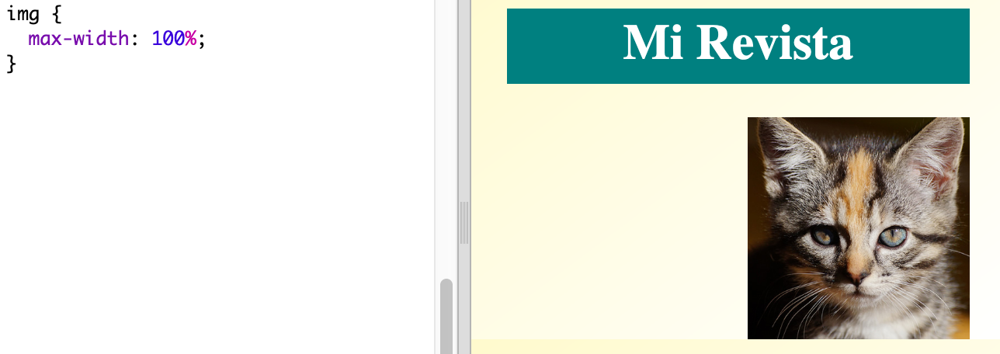

## Crear columnas

Las páginas web a menudo utilizan varias columnas. Vamos a hacer que tu revista tenga una distribución de dos columnas.

+ Primero, crea dos `div` de columna.

	Añade el siguiente HTML a `index.html`:

	

+ A continuación, dale estilo a los div de columna para que uno flote a la izquierda y el otro a la derecha.

	

	Las columnas ocupan menos del 50% para dejar espacio de relleno.

	Tendrás que añadir algo a una columna para ver el efecto.

+ Vamos a añadir la foto de un gatito en la parte superior de la columna 2.

	

	Fíjate que la imagen del gatito está situada más o menos en la mitad de la página, en la segunda columna.

	¡Parece un poco grande!

+ Vamos a usar `max-width: ` para hacer que las imágenes encajen en su contenedor.

	Añade este estilo en `style.css`.

	

	Este estilo se aplicará a todas las imágenes que uses en tu revista, no sólo a la del gatito.

+ Ahora añade una categoría ("class") de `foto` a la imagen para poder darle estilo:

	

+ Dale estilo a la imagen añadiendo sombra e inclinándola para que parezca que sobresale de la página:

	

	Haz varios cambios hasta que te guste el resultado.

