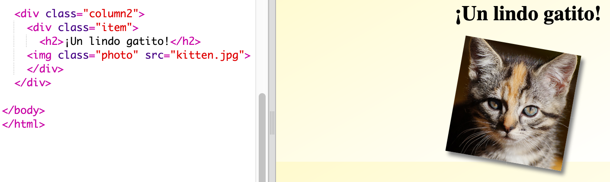
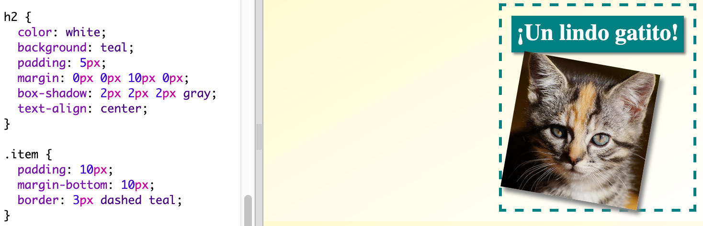

## Dar estilo a los objetos de la revista

Vamos a hacer el diseño un poco más interesante.

+ Añade un `div` alrededor de tu imagen con un atributo `class` y añade un encabezado `h2`:
    
    

+ Ahora, dale estilo al objeto y al encabezado.
    
    Aquí tienes un ejemplo, pero puedes hacer cambios:
    
    