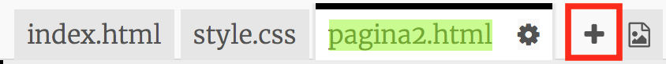
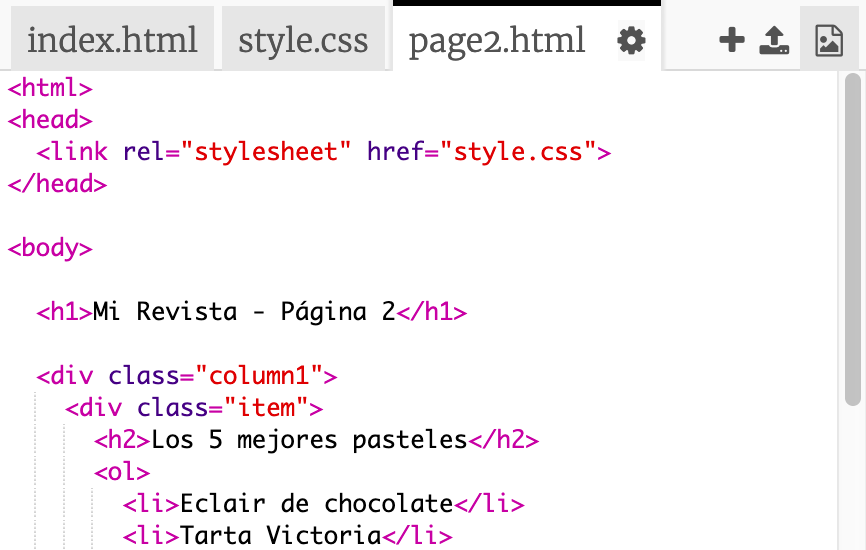
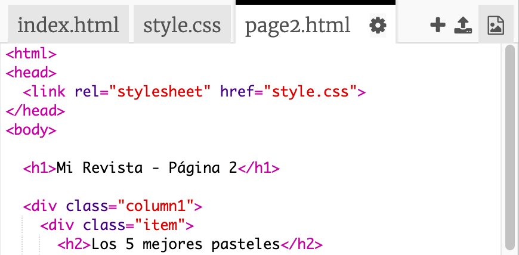
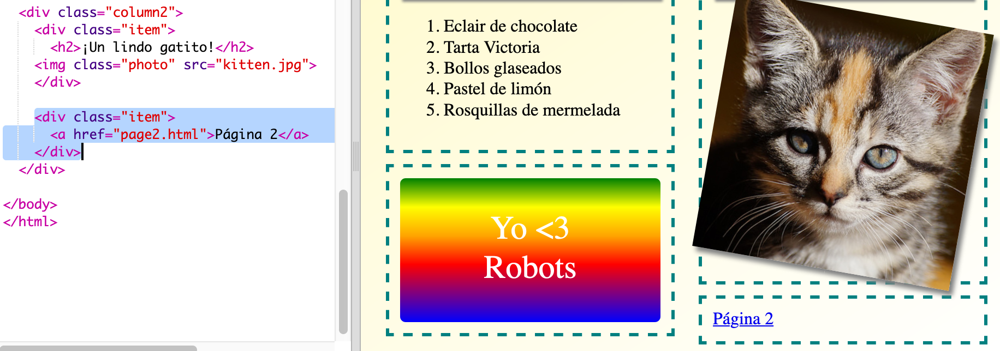

## Añade otra página

Vamos a añadir otra página al sitio web de tu revista.

+ Añade una nueva página a tu proyecto y llámala `page2.html`:

+ La página 2 será muy parecida a la primera página de tu revista, por lo que puedes copiar el HTML de `index.html` y pegarlo en `page2.html`.

Observa que ambas páginas usan el mismo `style.css`, así que compartirán los estilos.

+ Cambia el título `<h1>` para la Página 2:

+ Ahora necesitarás enlaces entre tus páginas para que puedas navegar a la página 2 y volver a la página principal.

Vuelve a `index.html`. Añade un enlace dentro de un div en la columna 2 de `index.html`:

+ Prueba que puedas hacer clic en tu nuevo enlace y navegues a la página 2 de tu revista.