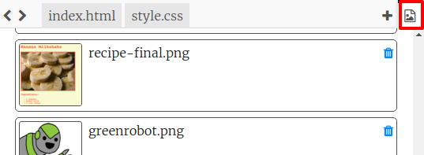

\--- challenge \---

## Desafío: Completa la segunda página

Aquí está el código para los ejemplos, pero puedes cambiar las etiquetas `div` o elaborar tus propias ideas.

Haz clic en el icono de las imágenes para ver qué imágenes están disponibles para usar:

Recuerda que puedes subir y utilizar tus propias imágenes. Asegúrate de que tienes permiso para usar cualquier imagen que cargues.

\--- /challenge \---