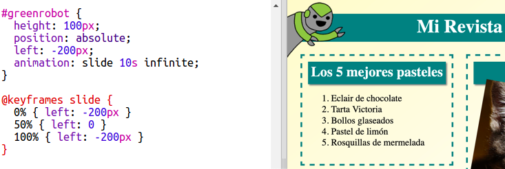

## Incluir una animación

Vamos a hacer que tu revista sea más divertida.

+ Selecciona `index.html` e incluye la imagen `greenrobot.png` en la parte superior de la página.

+ A continuación añade este CSS para animar a tu robot:

