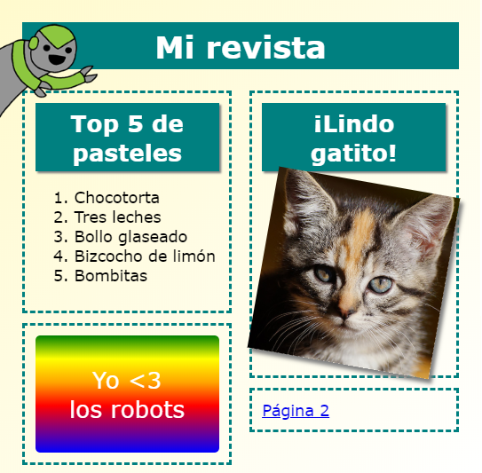

## Introducción

En este proyecto, aprenderás a usar HTML y CSS para crear el sitio web de una revista de varias páginas con un diseño de dos páginas. También repasarás muchas técnicas de HTML y CSS de otros proyectos.

  <iframe src="https://trinket.io/embed/html/0f34f6ddf0?outputOnly=true&start=result" width="600" height="505" frameborder="0" marginwidth="0" marginheight="0" allowfullscreen>
  </iframe>
  

### Información adicional para los líderes del club

Si necesitas imprimir este proyecto, usa la [versión para imprimir](https://projects.raspberrypi.org/es-LA/projects/magazine/print).

--- collapse ---
---
title: Notas para el líder del club
---
## Introducción

En este proyecto, los niños aprenderán a crear un diseño de dos columnas. También repasarán un montón de HTML & CSS que han aprendido en otros proyectos.

## Recursos en línea

Recomendamos usar [trinket](https://trinket.io/) para escribir HTML & CSS en línea. Este proyecto incluye los siguientes trinkets:

* [Punto de partida de la 'Revista' -- jumpto.cc/web-magazine](http://jumpto.cc/web-magazine)

Los niños también pueden hacer uso de este trinket en blanco [(jumpto.cc/html-blank)](http://jumpto.cc/html-blank) para escribir su propio HTML & CSS o alternativamente pueden usar esta plantilla de trinket [(jumpto.cc/html-template)](http://jumpto.cc/html-template).

También hay un trinket que contiene una solución de muestra para los desafíos:

* ['Revista' Finalizada -- trinket.io/html/0f34f6ddf0](https://trinket.io/html/0f34f6ddf0)

## Recursos sin conexión

Si prefieres, puedes completar este proyecto [sin conexión](https://www.codeclubprojects.org/en-GB/resources/webdev-working-offline/). Puedes acceder a los recursos del proyecto haciendo clic en el enlace 'Materiales del proyecto' para este proyecto. Este enlace contiene una sección de 'Recursos del proyecto', que incluye los recursos que los niños necesitarán para completar este proyecto offline. Asegúrate de que cada niño tenga acceso a una copia de estos recursos. Esta sección incluye los siguientes archivos:

* intro/index.html
* template/template.html
* template/style.css
* magazine/index.html
* magazine/style.css
* magazine/script.js
* magazine/mutliple .png images

También puedes encontrar una versión completa de los desafíos de este proyecto en la sección 'Recursos para voluntarios', que contiene:

* magazine-finished/index.html
* magazine-finished/style.css
* magazine-finished/script.js
* magazine-finished/kitten.jpg
* magazine-finished/recipe-finished.jpg
* magazine-finished/greenrobot.png
* magazine-finished/spacerobot.png

(Todos los recursos anteriores también se pueden descargar como archivos `.zip` de proyectos y para voluntarios.)

## Objetivos del Aprendizaje

* Este proyecto enseña a los niños cómo crear una revista con un estilo de diseño de dos columnas usando `float:`. También se repasa un montón de HTML & CSS cubierto con más detalle en otros proyectos. Se proporcionan ejemplos para que los niños puedan completar este proyecto incluso si no han completado algunos de los proyectos anteriores. 

Este proyecto abarca elementos de los siguientes aspectos de la [Creación digital de curriculum en Raspberry Pi Digital](http://rpf.io/curriculum):

* [Diseño de elementos básicos en 2D y 3D](https://www.raspberrypi.org/curriculum/design/creator).

## Desafíos

* "Añade artículos en la columna izquierda" - coloca artículos dentro del elemento flotante;
* "Añade un enlace que te devuelva a la primera página" - crea enlaces entre las páginas de un proyecto;
* "Completa tu segunda página" - repasa más HTML & CSS;
* "Añade otra animación" - repasa las animaciones.

--- /collapse ---

--- collapse ---
---
title: Materiales del proyecto
---
## Recursos del proyecto

* [Archivo .zip que contiene todos los recursos del proyecto](https://rpf.io/p/en/magazine-go)
* [Trinket en línea que contiene todos los recursos del proyecto 'Revista'](http://jumpto.cc/web-magazine)
* [Plantilla de Trinket en línea](http://jumpto.cc/trinket-template)
* [Trinket en blanco en línea](http://jumpto.cc/trinket-blank)
* [template/index.html](resources/template-index.html)
* [template/style.css](resources/template-style.css)
* [intro/index.html](resources/intro-index.html)
* [intro/style.css](resources/intro-style.css)
* [magazine/index.html](resources/magazine-index.html)
* [magazine/style.css](resources/magazine-style.css)
* [magazine/script.js](resources/magazine-script.js)
* [magazine/kitten.jpg](resources/magazine-kitten.jpg)
* [magazine/recipe-final.png](resources/magazine-recipe-final.png)
* [magazine/greenrobot.png](resources/magazine-greenrobot.png)
* [magazine/firerobot.png](resources/magazine-firerobot.png)
* [magazine/spacerobot.png](resources/magazine-spacerobot.png)
* [magazine/dogrobot.png](resources/magazine-dogrobot.png)

## Recursos para los líderes del club

* [Archivo .zip que contiene todos los recursos del proyecto terminado](https://rpf.io/p/en/magazine-go)
* [Proyecto Trinket completado en línea](https://trinket.io/html/0f34f6ddf0)
* [magazine-finished/index.html](resources/magazine-finished-index.html)
* [magazine-finished/style.css](resources/magazine-finished-style.css)
* [magazine-finished/script.js](resources/magazine-finished-script.js)
* [magazine-finished/kitten.jpg](resources/magazine-finished-kitten.jpg)
* [magazine-finished/recipe-final.png](resources/magazine-finished-recipe-final.png)
* [magazine-finished/greenrobot.png](resources/magazine-finished-greenrobot.png)
* [magazine-finished/spacerobot.png](resources/magazine-finished-spacerobot.png)

--- /collapse ---