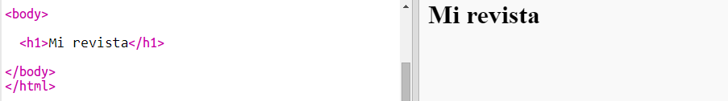
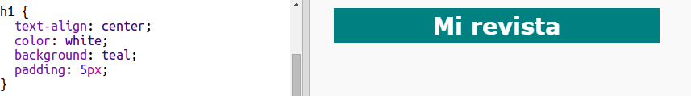
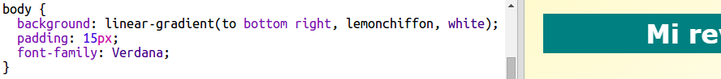

## Encabezado y fondo

Los sitios web diseñados al estilo de una revista a menudo tienen muchos elementos pequeños en sus páginas. En primer lugar, vas a crear un encabezado y un fondo para tu revista.

+ Abre este trinket: <a href="http://jumpto.cc/web-magazine" target="_blank">jumpto.cc/web-magazine</a>.
    
    El proyecto debería verse así:
    
    

+ Vamos a añadir un encabezado.
    
    Puedes pensar en un mejor título para tu revista.
    
    

+ ¿Puedes diseñar el encabezado?
    
    Aquí hay un ejemplo, pero puedes elegir tu propio estilo:
    
    

+ Ahora vamos a crear un fondo interesante usando un gradiente y eligir una fuente de letra para la revista.
    
    Aquí hay un ejemplo de estilo para recordar cómo se crea un gradiente:
    
    