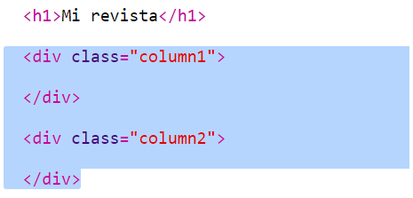
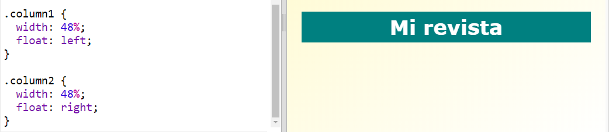
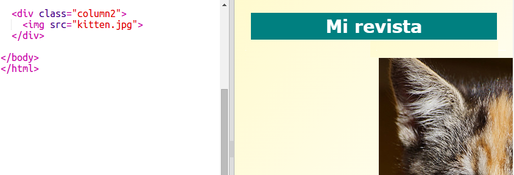
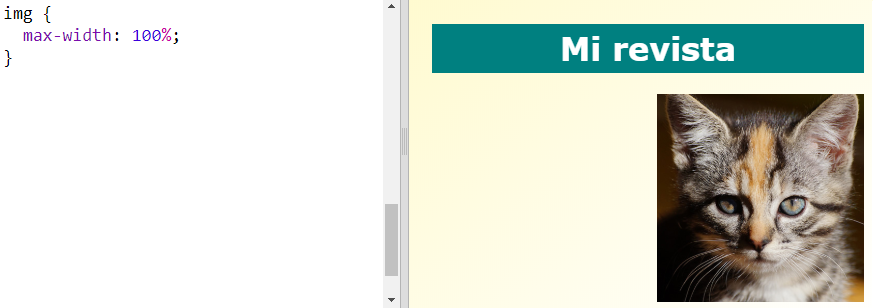

## Crear columnas

Los sitios web a menudo usan varias columnas. Vamos a crear un diseño de dos columnas para tu revista.

+ Primero crea dos columnas `div`s.
    
    Añade el HTML resaltado a `index.html`:
    
    

+ Ahora, dale estilo a los div de las columnas para que uno flote a la izquierda y el otro a la derecha.
    
    
    
    Cada columna tiene menos del 50% así que queda espacio para el relleno.
    
    Necesitarás añadir algo a una columna para ver el efecto.

+ Vamos a añadir la imagen de un gatito en la parte superior de la columna 2.
    
    
    
    Observa que la imagen del gatito está situada más o menos en la mitad de la página, en la segunda columna.
    
    ¡Pero está un poco grande!

+ Vamos a usar `max-width:` para hacer que las imágenes encajen dentro de su contenedor.
    
    Añade el siguiente estilo de tamaño en `style.css`.
    
    
    
    Éste se aplicará a todas las imágenes que utilices en tu revista, no solo al gatito.

+ Ahora, añade una clase `photo` a la imagen para que puedas darle estilo:
    
    

+ Y estiliza la imagen añadiéndole una sombra y girándola para hacer que la foto sobresalga de la página:
    
    
    
    Haz varios cambios hasta que te guste el resultado.